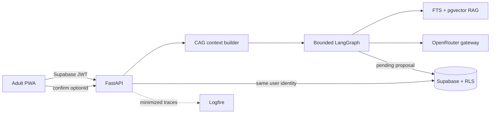

# Kids Learning System — Alfredo Pretel

Product, pedagogy, content, UX, data, AI, and engineering repository for a family learning companion that turns everyday materials into purposeful hands-on activities.

> **Status:** Final-project implementation candidate on `finalproject-AP`. The executable catalog is synthetic-only until each exact activity version completes the documented founder and editorial publication gates. “Kids Learning System” is an internal name.

> **Language policy:** English is the normative source from 18 August 2026 under `DEC-052`. Start with the [canonical English documentation](docs/README.md). Spanish documents are preserved as historical records and must not receive new requirements, decisions, or changes.

## Repository purpose

This repository is the source of truth for designing and later building the product. The documentation separates three connected systems:

1. **Learning system:** skills, concepts, progression, observations, and evidence.
2. **Content system:** a validated activity library, learning focuses, suggested contributions, materials, visuals, and safety.
3. **Software product:** families, profiles, planning, delivery, AI, data, and interfaces.

AI does not improvise the core of an activity for a family. It selects a published activity, suggests an appropriate focus and contribution for each child, and may propose adaptations only within defined limits.

## Start here in English

1. [Canonical English documentation](docs/README.md)
2. [Backend collaboration handoff](docs/BACKEND-HANDOFF.md)
3. [Specification map](docs/SPECIFICATION-MAP.md)
4. [Activity-library dataset map](docs/02-content/activity-library-dataset-map.md)
5. [Logical database schema](docs/06-data/logical-database-schema.md)
6. [English instructions for development agents](AGENTS.md)
7. [Five-day founder dry run](docs/08-delivery/sofia-five-day-dry-run-v0.1.md)
8. [Five-day shopping list](docs/08-delivery/sofia-shopping-list-v0.1.md)
9. [Founder dry-run observation sheet](docs/08-delivery/founder-dry-run-observation-sheet-v0.1.md)
10. [English prototype guide](prototypes/family-mobile-v0.1/README.md)

The canonical documentation contains the full English specifications. The earlier collaboration guide is retained only as a historical navigation aid.

## Documentation architecture

```text
docs/
├── 00-foundation/   Vision, principles, scope, vocabulary, compliance, and open questions
├── 01-learning/     Learning framework, Learner Model, Family Model, graph, and evidence
├── 02-content/      Activity contracts, editorial workflow, visuals, and safety
├── 03-product/      Personas, journeys, modules, requirements, and commercial/community specs
├── 04-ux/           Information architecture, interaction rules, facilitation, and flows
├── 05-ai/           AI companion, recommendations, adaptation, and evaluations
├── 06-data/         Conceptual model, dictionary, permissions, and retention
├── 07-engineering/  Architecture, API contracts, security, offline behavior, and testing
└── 08-delivery/     Roadmap, vertical slices, decisions, pilot material, and traceability
schemas/             JSON Schema contracts and fictional examples
scripts/             Executable contract and documentation validation
prototypes/          Interactive artifacts for validating UX before production implementation
```

## Non-negotiable product rules

- Every family-delivered activity must come from a published library version.
- AI may not change materials, steps, or constraints in a way that changes the safety profile.
- Each child has at most one primary objective evaluated per session; other skills are exposures unless the adult chooses **Evaluate more**.
- Conclusions about a child must be traceable to observations and must express uncertainty.
- Educational observations must never become clinical, psychological, intelligence, or diagnostic labels.
- Do not store unnecessary child images, audio, or personal data by default.
- Use an age range instead of a full birth date whenever the range is sufficient.
- The adult can skip, correct, retain, and delete.
- The default assessment flow must be completable in under 20 seconds for three children; this is an internal usability metric, not an on-screen timer.

## Document status

- `Draft`: incomplete or subject to central decisions.
- `Review`: developed enough for discussion.
- `Approved`: accepted as a source of truth.
- `Superseded`: replaced by another document or decision.
- `Active`: an operational register that must be kept current.

No translation changes a document's status. A file must not be marked `Approved` without human confirmation.

## Current prototype

The [family mobile prototype v0.6](prototypes/family-mobile-v0.1/index.html) supports English and Spanish across the five-day founder pilot, including planning, activity detail, consolidated shopping, learning focuses, preparation, six-stage facilitation, contextual help, close-out, installation, and offline shell behavior. It uses synthetic data and `Draft` or candidate content; it is not a production family delivery.

The final-project implementation lives in [`apps/web`](apps/web) and [`services/ai`](services/ai). It adds an authenticated, block-rendered React PWA and a bounded FastAPI companion with CAG, hybrid-RAG contracts, explicit adult confirmation and minimized telemetry.

## Problem and product outcome

Adults often abandon a planned hands-on activity when materials, time, difficulty or a failed physical result creates friction. Kids Learning System keeps the reviewed guide usable and adds one text companion that can troubleshoot the exact step, propose an approved adaptation, or offer up to three eligible replacement activities.

The primary pilot outcome is the percentage of planned activities completed, with a target of at least 70%. Without a control group, this is reported descriptively and never as causal uplift.

## Architecture



- The LLM interprets and explains; deterministic software owns authorization, publication, eligibility, safety, validation and mutation.
- CAG contains stable policy, the exact immutable version/current block and retrieved evidence; this release sends no family or learner identifiers to the model.
- RAG searches only published, locale-specific chunks for the exact activity. Replacement hard filters run before ranking.
- A mutation is a server-side pending proposal followed by an idempotent adult decision.
- `ContentBlock[]` and the frontend renderer registry allow activity structures to evolve without rebuilding the whole screen or database.

Detailed decisions are in [CAG, RAG and bounded agent runtime](docs/05-ai/cag-rag-and-agent-runtime.md), [Production runtime](docs/07-engineering/production-runtime.md), and the [Decision log](docs/08-delivery/decision-log.md).

## Run locally

### Docker demo

```bash
docker compose up --build
```

Open `http://localhost:8080`. Demo mode is synthetic, requires no child or family data, and continues with deterministic guidance when no OpenRouter key is present.

### Development

```bash
npm install
python -m venv .venv
# Windows: .venv\Scripts\activate
# macOS/Linux: source .venv/bin/activate
python -m pip install -r services/ai/requirements-dev.txt
uvicorn services.ai.app:app --reload
npm run dev --workspace @kids/web
```

Copy `.env.example` to an ignored environment file. Never expose `SUPABASE_SECRET_KEY` or `OPENROUTER_API_KEY` as `VITE_` variables.

## API

FastAPI exposes interactive OpenAPI documentation at `/docs` and three product endpoints:

- `GET /v1/experiences/{contextId}`
- `POST /v1/companion/interactions`
- `POST /v1/companion/proposals/{proposalId}/decision`

The JSON wire contracts are versioned under [`packages/contracts`](packages/contracts). Production calls require an adult Supabase bearer token and family-scoped RLS access.

## Data model and security

The [Supabase migration](supabase/migrations/202609050001_final_project_core.sql) defines family membership, minimal Learners, immutable activity versions, RAG chunks, experience snapshots, pending proposals, idempotent decisions, preference signals, minimized interactions, provider eligibility and audit events. The packaged synthetic catalog lives at [`services/ai/data/activities/catalog.json`](services/ai/data/activities/catalog.json) so the API, ingestion command and deployment share one source.

Every public table has RLS. The browser receives only a publishable Supabase key. Raw companion messages are not persisted by default; audit stores intent, outcome, source IDs, route and latency. Production catalog ingestion requires founder execution evidence for each `pilot` or `production` version.

## Evaluation and tests

```bash
npm run validate
python -m scripts.ingest_catalog --release-channel synthetic-demo --dry-run
```

Validation includes legacy schema/domain/document checks, React tests/build, FastAPI tests and [40 golden scenarios](evals/golden-set.json) in both languages (80 runs). The release gates and failure taxonomy are documented in [Golden set v1](docs/05-ai/golden-set-v1.md).

The recorded test results and the boundary between completed implementation and external/human gates are in [Final-project implementation evidence](docs/08-delivery/implementation-evidence.md).

## Deployment

- Create one Vercel project rooted at `apps/web` and one rooted at `services/ai`.
- Apply the reviewed Supabase migration, run database advisors, configure Auth invitations and ingest the catalog.
- Set production environment variables from `.env.example`; set `DEMO_MODE=false` and `VITE_DEMO_MODE=false`.
- Validate preview deployments with the evaluator's synthetic family before promotion.

No deployment credential is committed. The current historical static prototype remains available at `https://pr3t3l.github.io/KidsApp/`; it is not the authenticated final-project environment.

## Known limitations and next steps

- The ten executable activity records are synthetic evaluation fixtures, not physical-publication evidence.
- Real-family activation requires founder execution, exact content hashes, safety/editorial gates and a state applicability review.
- The deterministic golden suite does not replace human usefulness grading or live-model groundedness evaluation.
- Confirmed preference signals are recorded but do not personalize replacement ranking until that feedback loop is evaluated.
- Voice, photos, community, payments, native mobile packaging, multi-agent orchestration and autonomous content generation are intentionally outside this release.
- Vercel Hobby is suitable only for personal academic validation; commercial operation requires a suitable plan and legal/privacy review.

## Next milestone

Run the exact-version founder activity checks, connect a Supabase project and both Vercel projects, execute live-model evaluation through approved OpenRouter routes, and record the resulting deployment/video evidence in [Final project delivery](docs/08-delivery/final-project-delivery.md).
