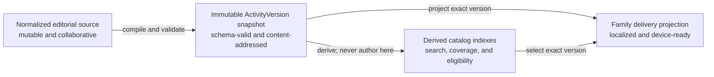
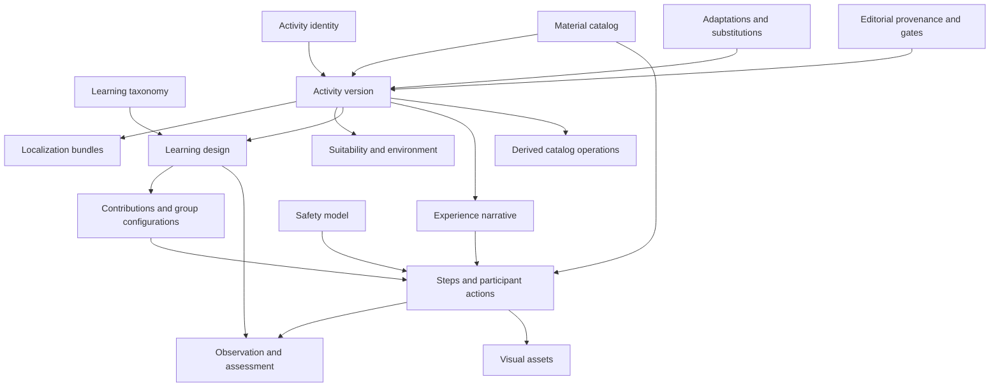
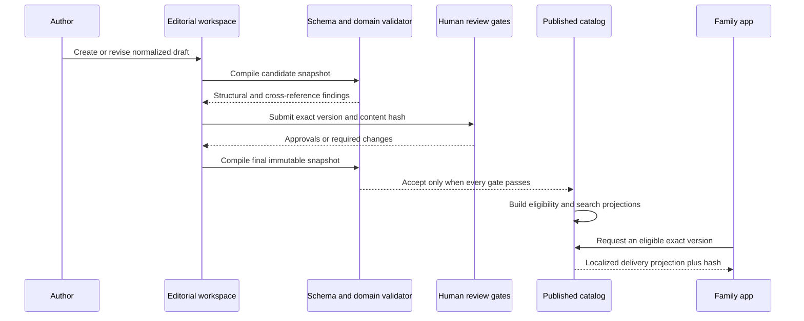

# Activity Library Dataset Map

**Status:** Draft
**Version:** 0.1
**Owners:** Content, Pedagogy, Safety, Data, Engineering
**Normative language:** English under `DEC-052`

## 1. Purpose

Define the complete data map required to author, review, publish, search, recommend, download, deliver, assess, and retire activities in the Kids Learning System library.

This document describes the canonical dataset. The executable [`ActivityVersion` JSON Schema](../../schemas/v0.1/activity-version.schema.json) remains the machine-readable contract for an immutable activity version. The [logical database schema](../06-data/logical-database-schema.md) describes how the broader product can persist this dataset without committing to a database vendor.

## 2. Dataset architecture

The library must not use one mutable activity record for every purpose. It has four representations with different lifecycles:



| Representation | Purpose | Mutability | Source of truth |
|---|---|---|---|
| Editorial source | Drafting, comments, review, pilots, and revision | Mutable with audit history | Editorial workspace |
| `ActivityVersion` snapshot | Exact approved content and rules | Immutable | JSON Schema plus domain validation |
| Delivery projection | Minimal payload needed for a plan or session | Immutable for the pinned version | Derived from `ActivityVersion` |
| Catalog indexes | Fast filtering, ranking, coverage, and reporting | Rebuildable | Derived from published snapshots and operational data |

Family sessions always pin the immutable snapshot, never a mutable draft or a search-index document.

## 3. Complete dataset map



### 3.1 Learning taxonomy

The taxonomy is shared across activities and versioned independently.

| Entity | Required data |
|---|---|
| `LearningArea` | stable code, canonical name, definition, status, taxonomy version |
| `Skill` | stable ID, area, observable definition, functional levels, evidence examples, non-evidence examples, status |
| `Concept` | stable ID, area, definition, explanation boundaries, status |
| `LearningNodeLocalization` | node ID, locale, name, adult explanation, child-friendly explanation |
| `LearningEdge` | source node, target node, relationship type, strength, rationale, version |
| `SkillRubric` | skill, context or activity scope, rating anchors, observable actions, invalid inferences |

Allowed graph relationships include `PART_OF`, `SUPPORTS`, `PREREQUISITE_FOR`, `OBSERVABLE_BY`, and `RELATED_TO`. The graph never stores a child's score.

### 3.2 Normalized material catalog

Materials are normalized globally so inventory, shopping, substitution, safety, and reuse can operate across activities.

| Entity | Required data |
|---|---|
| `Material` | stable ID, canonical category, physical description, default unit, consumable/reusable classification, active status |
| `MaterialLocalization` | material ID, locale, display name, description, search aliases |
| `MaterialRegionalAlias` | material ID, locale/region, alias, notes |
| `MaterialStoreSection` | material ID, region, store section, sort priority |
| `MaterialPackageOption` | purchasable quantity, unit, typical package description; no live price required |
| `MaterialHazardProfile` | hazard category, condition of risk, age/supervision limits, source and review state |
| `MaterialEquivalenceClass` | materials that may serve a similar function; it does not approve substitution by itself |
| `UnitDefinition` | canonical unit, dimension, display symbols, conversion factor where conversion is physically valid |

The normalized material record does not determine how it is used in an activity. `ActivityMaterialRequirement` provides quantity, function, preparation, and activity-specific safety constraints.

### 3.3 Activity identity

`Activity` is the stable concept across versions.

| Field | Meaning |
|---|---|
| `activity_id` | Stable public/internal identifier such as `ACT-0001` |
| `slug` | Stable human-readable technical key |
| `canonical_working_title` | Internal editorial label; family title remains localized by version |
| `activity_family` | Optional relationship to a related series; never a substitute for versioning |
| `ownership` | Internal, commissioned, licensed, adapted, or public-domain claim |
| `active_version_id` | Derived pointer to the version eligible for new recommendations |
| `created_at`, `created_by` | Provenance |

There may be many versions, but there is no mutable “current content” embedded in the `Activity` row.

### 3.4 Activity version identity and integrity

| Field | Meaning |
|---|---|
| `activity_version_id` | Internal immutable primary key |
| `activity_id` | Parent stable activity |
| `semantic_version` | `major.minor.patch` |
| `schema_version` | Contract version used to validate the snapshot |
| `status` | Draft through retired lifecycle state |
| `content_hash` | SHA-256 of the canonical serialized snapshot |
| `snapshot_payload` | Exact schema-valid `ActivityVersion` document |
| `created_at`, `created_by` | Authorship provenance |
| `published_at`, `retired_at` | Lifecycle timestamps where applicable |
| `supersedes_version_id` | Optional previous version relationship |
| `retirement_reason` | Required when retired |

The unique business key is `(activity_id, semantic_version)`. A published snapshot cannot be edited in place. Any content, safety, localization, or rule change creates another version according to the lifecycle policy.

### 3.5 Localization

All language-neutral IDs, rules, quantities, references, and enums stay outside localization. Localized content is stored by exact version and locale.

Required `en-US` and `es-US` content includes:

- title, summary, and activity promise;
- opening question and reflection questions;
- brief and detailed adult explanations;
- child-friendly explanation;
- step titles, instructions, scripts, expected results, warnings, and resume guidance;
- role/contribution names and descriptions;
- material display names and preparation instructions;
- adaptations, troubleshooting, assessment questions, and alt text.

Each localized field has a completeness state, reviewer, reviewed content hash, and review date in editorial source data. Translation cannot change quantities, actor permissions, mechanism, or safety meaning.

### 3.6 Suitability and operational context

| Group | Required fields |
|---|---|
| Age | minimum and maximum years; specific exclusions |
| Functional levels | supported `L1`–`L4` values |
| Participants | minimum, maximum, and exact supported counts from 1–4 |
| Timing | minimum/maximum activity time, adult preparation, cleanup, per-step estimates |
| Environment | allowed spaces, minimum surface/space, indoor/outdoor, water access, ventilation, noise, mess level |
| Adult load | supervision level, simultaneous attention demand, adult-only preparation |
| Accessibility | published supports, motor/sensory/language considerations, limits |
| Connectivity | offline-delivery capability and assets required in the pack |

Suitability is an eligibility input, not a statement of a child's ability.

### 3.7 Educational design

Every version includes:

- experience goal and learning mechanism;
- primary and secondary areas;
- linked skills and concepts;
- authentic child decisions and fixed constraints;
- adult look-fors that do not interrupt the activity;
- supported learning-cycle stages;
- objective guidance for every skill eligible as a primary objective;
- simplification and extension boundaries;
- recommended prerequisites expressed as guidance, not absolute barriers.

`ObjectiveGuidance` contains `skill_id`, starting age range, intent (`exploration`, `growth`, or `consolidation`), rationale, approved simplification, and approved extension. The recommendation engine combines it with actual evidence; the dataset does not assign an objective permanently by age.

### 3.8 Experience narrative

The narrative dataset makes the physical sequence reproducible:

| Entity | Required data |
|---|---|
| `ExperienceNarrative` | mode, starting state, ending state, participant completion policy |
| `NarrativeState` | stable state ID and localized physical/informational description |
| `MaterialFunction` | material requirement, introduction step, purpose |
| `ParticipantCycleRequirement` | required essential actions and audience |
| `StateTransition` | source state, step, destination state, transition reason |

Modes are `individual_cycles`, `shared_artifact`, and `hybrid`. Essential actions are `encounter_problem`, `propose`, `build_or_do`, `test_or_check`, `observe_result`, `improve_or_recommend`, and `explain`.

### 3.9 Suggested contributions and group configurations

The editorial dataset retains internal `RoleTemplate` records while the family UI presents a learning focus and suggested contribution.

| Entity | Required data |
|---|---|
| `RoleTemplate` | stable version-scoped ID, localized name, meaningful contribution, compatible levels |
| `RoleEligiblePrimarySkill` | role and skill |
| `RoleExposureSkill` | role and secondary skill |
| `RoleExposureConcept` | role and concept |
| `RoleStepPermission` | allowed/restricted step |
| `RoleResponsibility` | localized responsibility and order |
| `GroupConfiguration` | participant count, role-template set, configuration notes |
| `GroupConfigurationSlot` | one logical assignment slot per participant position |

Every supported participant count has a validated configuration. A role never automatically turns the oldest child into a supervisor.

### 3.10 Steps, actions, and continuity

Each step stores:

- stable step ID, sequence, cycle stage, and actor;
- entry/exit states and transition reason;
- localized title, learning purpose, instruction, and expected result;
- numbered adult actions and literal facilitator prompts;
- participant action templates resolved to actual names at session time;
- cycle actions and audiences;
- material uses and their purpose at that moment;
- child decision or explicit absence of a decision;
- observation cues linked to skills and `do_not_infer` boundaries;
- minutes, success signal, warning, and resume instruction;
- troubleshooting cases and safe responses;
- linked visual briefs;
- skill and concept exposures derived from the actual step/role participation.

Participant action templates declare audience, eligible roles, action, and turn order (`simultaneous`, `sequential`, or `facilitator_cued`).

### 3.11 Safety dataset

| Entity | Required data |
|---|---|
| `ActivitySafetyProfile` | participation level A–D, localized supervision, cleanup |
| `Hazard` | category, condition, exposed actor, severity/likelihood rationale, description |
| `HazardControl` | control, relevant material/step, responsible actor, verification method |
| `AdultOnlyStep` | exact step and reason |
| `StopCondition` | localized observable stop signal and safe-stop response |
| `ProhibitedAdaptation` | prohibited change and safety rationale |
| `SafetyReviewRequirement` | required gate derived from category and risk |
| `Incident` | pilot/version, severity, event, response, disposition, review status |

Safety filters are deterministic. AI may explain an approved control but cannot create, remove, or weaken one.

### 3.12 Substitutions, adaptations, and extensions

These are distinct records:

| Type | Required structure |
|---|---|
| Approved substitution | source requirement, replacement material, quantity/unit, conditions, mechanism equivalence, safety impact, review gate |
| Presentation adaptation | localized presentation change with no mechanism change |
| Difficulty adaptation | exact change, eligibility condition, educational effect, resume point |
| Role adaptation | compatible contribution change and affected mappings |
| Duration adaptation | allowed reduction/extension without breaking the essential cycle |
| Simplification | support that preserves the primary learning opportunity |
| Extension | additional published steps, limits, exposures, and stop conditions |

Every option has a stable ID, applicable version, conditions, exact changes, safety impact, whether adult confirmation is required, and approval record.

### 3.13 Observation and assessment

For every skill eligible as a primary objective, the activity version contains:

- a localized contextual independence question;
- verbal 1–5 anchors or a referenced approved rubric;
- examples of evidence;
- examples that do not count as evidence;
- external factors such as material failure or mandatory adult action;
- relevant observation cues by step;
- whether optional **Evaluate more** is supported.

The activity library defines what may be observed. Actual ratings, observations, and inferences belong to session and learner records, not the library.

### 3.14 Visual assets and media rights

| Entity | Required data |
|---|---|
| `VisualBrief` | stable ID, type, purpose, style, must-show, must-not-show, linked steps, localized alt text |
| `VisualCandidate` | provider/model or source, prompt/brief version, generated/received time, checksum |
| `VisualQAResult` | automated findings, confidence, status, tool version |
| `VisualAsset` | approved candidate, file variants, dimensions, MIME type, checksum, storage key |
| `RightsRecord` | ownership/license basis, permitted uses, territory, term, attribution, evidence document |
| `VisualApproval` | reviewer, exact activity/content hash, decision, date |

An asset is bound to an exact activity version. A changed material, actor, connection, step, or warning invalidates affected approvals.

### 3.15 Editorial provenance and publication gates

| Entity | Required data |
|---|---|
| `ContentSource` | internal, commissioned, licensed, adapted, or public-domain basis |
| `ExternalSourceRecord` | source URL/provider, source title, retrieved date, license, evidence, permitted transformations |
| `Contributor` | internal actor reference and editorial roles |
| `ReviewRequirement` | required gate and reason |
| `ReviewRecord` | reviewer role, decision, version, content hash, findings, date |
| `PilotRecord` | facilitator kind, participant count/age bands, duration, outcome, incidents, observations |
| `NarratedWalkthrough` | version, maximum participant configuration, reviewer, findings |
| `ChangeLogEntry` | semantic version, summary, rationale, affected sections |
| `RetirementRecord` | reason, effective time, replacement, family-delivery consequences |

External activity inspiration never enters the library without provenance and license review. Facts and general ideas may inform design, but copied expression, images, worksheets, or distinctive instructions require a documented legal basis.

### 3.16 Derived catalog and coverage indexes

The following are rebuildable projections, not authoring sources:

- eligible published version by market and locale;
- age, participant-count, time, space, mess, supervision, and safety filters;
- required and optional material IDs;
- store-section shopping projection and reusable/consumable aggregation mode;
- area, skill, concept, mechanism, and learning-cycle coverage;
- role and primary-objective compatibility matrix;
- offline asset manifest inputs;
- text-search document by locale;
- operational aggregates: completion, actual duration, help frequency, missing materials, difficulty distribution, and incidents;
- coverage gaps for future editorial planning.

Operational aggregates must use thresholds that prevent exposing one family's behavior in editorial dashboards.

## 4. Canonical activity-version envelope

The full immutable document follows this shape; nested objects are defined by the JSON Schema:

```json
{
  "schemaVersion": "0.1",
  "activityId": "ACT-0001",
  "version": "1.0.0",
  "contentHash": "sha256:<64 lowercase hex characters>",
  "status": "published",
  "locales": { "en-US": {}, "es-US": {} },
  "ageRange": {},
  "levels": [],
  "participants": {},
  "timing": {},
  "environment": {},
  "learning": {},
  "experienceNarrative": {},
  "objectiveGuidance": [],
  "materials": [],
  "roleTemplates": [],
  "groupConfigurations": [],
  "steps": [],
  "safety": {},
  "adaptations": [],
  "observationPrompts": [],
  "visualBriefs": [],
  "editorial": {}
}
```

`published` above is illustrative only; none of the current pilot activities becomes published through this example.

## 5. Authoring-to-delivery pipeline



## 6. Required invariants

- **DATA-LIB-001:** A family-delivered activity resolves to one exact immutable `ActivityVersion`.
- **DATA-LIB-002:** `(activity_id, semantic_version)` and `content_hash` are unique.
- **DATA-LIB-003:** A published snapshot contains complete `en-US` and `es-US` bundles.
- **DATA-LIB-004:** Every internal reference resolves within the snapshot or to an explicitly versioned shared taxonomy/material record.
- **DATA-LIB-005:** Every supported participant count has a complete, validated group configuration.
- **DATA-LIB-006:** Every eligible primary skill has objective guidance, observation cues, and an assessment prompt.
- **DATA-LIB-007:** Every required material has a function, introduction step, quantity/unit, and safety treatment.
- **DATA-LIB-008:** Step states form a continuous path from the declared starting state to the ending state.
- **DATA-LIB-009:** Every active participant receives the required essential-cycle actions when physically viable.
- **DATA-LIB-010:** Safety hazards, controls, adult-only steps, stop conditions, and prohibited adaptations are structured and cross-referenced.
- **DATA-LIB-011:** A substitution or adaptation is deliverable only when approved for the exact version and applicable conditions.
- **DATA-LIB-012:** Visual assets and rights records bind to the exact version and affected steps.
- **DATA-LIB-013:** Publication requires the exact human reviews and pilot evidence determined by category and risk.
- **DATA-LIB-014:** Search, recommendation, shopping, and coverage indexes are derived and rebuildable.
- **DATA-LIB-015:** External sources retain license/provenance evidence and may not silently become proprietary content.
- **DATA-LIB-016:** Retiring a version immediately removes it from new eligibility while preserving historical session resolution.
- **DATA-LIB-017:** Operational aggregates never become editable evidence about an individual child.

## 7. Minimum delivery projections

| Consumer | Minimum projection |
|---|---|
| Catalog card | exact version ID, localized title/summary, duration, age range, participant range, primary area, thumbnail, safety level |
| Activity detail | educational purpose, areas/concepts/skills, materials, preparation, safety, participant contributions, complete phase outline |
| Weekly planner | eligibility fields, material requirements, durations, cleanup, mechanism/coverage tags, compatible objectives |
| Shopping list | normalized material ID, localized name, quantity/unit, aggregation rule, store section, activity/day provenance |
| Session | exact localized steps, participant action templates, actual assignments, safety controls, help, observation mappings |
| Offline pack | immutable snapshot/projection hash, all referenced assets, locale, expiry, retirement metadata |
| Editorial QA | normalized source, compiled snapshot, findings, reviews, pilots, rights, and full audit history |

## 8. Validation layers

1. **Schema validation:** required shape, enums, formats, and local constraints.
2. **Domain validation:** unique IDs, reference integrity, ranges, narrative continuity, cycle coverage, publication gates, and safety references.
3. **Editorial review:** educational accuracy, reproducibility, language, accessibility, and safety.
4. **Physical pilot:** real materials, timing, failures, participant configurations, and safe-stop behavior.
5. **Release validation:** localized delivery projection, visual fidelity, offline completeness, search/eligibility behavior, and retirement test.

Passing an automated validator never constitutes publication approval.

## 9. Implementation boundary

This specification does not decide the database engine, ORM, content-management framework, API protocol, or search provider. Those remain explicit architecture decisions. The required outcome is that every stored or derived representation preserves the identities, immutability, safety, localization, and traceability rules above.
