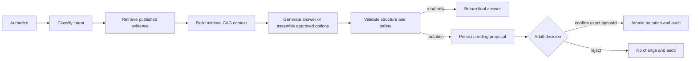

> **Canonical English document.** This document is normative from 5 September 2026 under `DEC-052`.

# CAG, RAG and bounded agent runtime

**Status:** Review
**Version:** 1.0

## Product value and AI boundary

The runtime exists to reduce abandonment when an adult encounters friction before or during a published activity. AI interprets a free-form request and explains retrieved guidance. Deterministic code owns identity, eligibility, publication, safety, option validation, confirmation and mutation.

The family UI exposes one companion button and a text box. The internal intent is one of `troubleshoot`, `adapt_current_activity`, or `replace_planned_activity`. A request may produce an answer, one clarification, a validated proposal, or `safe_stop`.

## CAG assembly

Context is assembled in this precedence order:

1. Safety and privacy policy.
2. Structured response contract.
3. Exact immutable `ActivityVersion` identifier, locale and current effective block.
4. At most five retrieved evidence chunks from that same version and locale.

The current implementation sends no family identifier, adult identifier, Learner record, full activity history or raw prior conversation to the model. It excludes full names, birth dates, addresses, school, diagnosis and another family's data. Published instructions remain available when model generation fails. Structured preferences remain server-side in this release and are not added to generation context.

## RAG pipeline

Only published, curated activity content enters retrieval. Chunks are created along domain boundaries: overview, exact step, troubleshooting, approved adaptation, safety control and approved source. `en-US` and `es-US` use separate chunks with shared stable references.

Production retrieval applies authorization and metadata filters before ranking. PostgreSQL full-text search and pgvector semantic search each return up to eight candidates; reciprocal rank fusion returns at most five, and semantic-only matches below the configured similarity floor are excluded. Troubleshooting is restricted to the exact activity version and locale. Replacement candidates pass deterministic age, participant, duration, publication and safety-level filters. Inventory-aware replacement is a documented next step because the release does not yet collect a reliable household inventory.

No private conversation, child record, draft, retired content or model prompt belongs in a shared retrieval index. An answer with insufficient evidence must abstain or return `safe_stop`.

## Bounded LangGraph flow

The graph is a bounded workflow, not a multi-agent system. Model output cannot invoke arbitrary tools. The API boundary represents the human-in-the-loop pause; durable proposal state and an idempotency key allow safe resumption on any serverless instance.

## Allowed tools

| Tool | Authority |
|---|---|
| `get_current_experience_context` | Read one authorized family context. |
| `retrieve_troubleshooting_guidance` | Read published chunks for the exact version and locale. |
| `list_approved_adaptations` | Read approved options for the exact version. |
| `search_eligible_replacements` | Return at most three hard-filtered published candidates. |
| `validate_companion_proposal` | Enforce schema, safety and option references. |
| `apply_confirmed_adaptation` | Apply one confirmed version-scoped option atomically. |
| `apply_confirmed_replacement` | Apply one confirmed eligible version atomically. |
| `record_preference_signal` | Store only a structured, correctable category. |
| `record_interaction_feedback` | Store useful/not-useful and an optional structured reason. |

There is no general SQL, browser, filesystem, code execution or content-publication tool.

## Preference rules

An explicit family constraint is persisted only after the adult confirms the proposal that produced it. Ordinary reasons are stored as low-strength structured signals; explicit constraints receive higher strength. This release records but does not yet personalize ranking from these signals, avoiding an unvalidated hidden feedback loop. Raw companion text is never written to the durable interaction table; only structured action, confirmed preference, metrics and minimized audit records remain.

## Failure behavior

- Authorization or retrieval failure returns no protected detail.
- Model timeout tries one equally eligible configured route, then uses the published guide and safe-stop language.
- Invalid generated JSON is rejected, never repaired into a mutation.
- An unknown required UI block prevents activity start.
- A proposal cannot be applied twice or with an unlisted option.

## Requirements

- **AI-RUN-001:** The public UI exposes one text companion entry point while every request receives an internal intent.
- **AI-RUN-002:** Mutations require a pending server-side proposal and explicit adult confirmation of a listed `optionId`.
- **AI-RUN-003:** Troubleshooting sources belong to the exact published version and locale.
- **AI-RUN-004:** Replacement hard filters execute before semantic ranking.
- **AI-RUN-005:** Provider fallback preserves the same capability and data-eligibility restrictions.
- **AI-RUN-006:** The system retains structured telemetry rather than raw prompts by default.
- **AI-RUN-007:** The published activity guide remains usable without AI.
