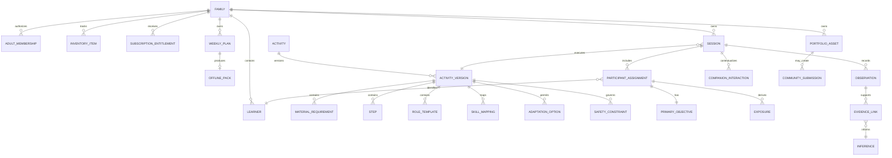

> **Canonical English document.** This document is normative from 18 August 2026 under `DEC-052`. The Spanish [historical record](../../historical/es/docs/06-data/conceptual-model.md) is retained for traceability; all new requirements, decisions, and changes belong in English.

# Conceptual data model

**Status:** Draft
**Version:** 0.1

## Domains

## Aggregate limits

### Family

Controls membership, permissions, preferences, and inventory. It authorizes access to learner records but does not contain those records directly.

### ActivityVersion

Immutable content snapshot. Steps, materials, roles, safety controls, and adaptations are versioned together or through immutable references. Only a published version is eligible for family delivery.

### Session

Records actual delivery: exact version, context, participants, assignments, participation changes, exposures, step progress, and close-out.

### Learner Model

Composes observations and derived inferences linked to one Learner. Inferences remain reconstructable from evidence and correction history.

### Media and Community

Separates a private asset, community-safe derivative, submission, moderation decision, and marketing license. One permission never implies another.

## Invariants

- A Session points to an exact ActivityVersion.
- A ParticipantAssignment points to a single Learner and compatible RoleTemplate.
- At most one active PrimaryObjective exists per participant and session.
- Exposure has no performance field.
- Observation preserves source and context.
- An Inference links to one or more valid observations through EvidenceLinks.
- Media is stored separately with purpose and expiration.
- A retired version remains available for historical sessions but becomes ineligible for new recommendations.
- A CommunitySubmission requires authorized adult uploader and moderation status.
- A marketing license is independent of community-publishing permission.

## Domain Events

- `FamilyCreated`
- `LearnerAdded`
- `ActivityVersionPublished`
- `WeeklyPlanGenerated`
- `SessionStarted`
- `ParticipationChanged`
- `RoleChanged`
- `SessionCompleted`
- `ObservationRecorded`
- `InferenceProposed`
- `InferenceCorrected`
- `MediaExpired`
- `ActivityVersionRetired`
- `OfflinePackDownloaded`
- `SubscriptionEntitlementChanged`
- `CommunitySubmissionCreated`
- `CommunitySubmissionModerated`
- `CommunityPostRetired`

## Pending physical design

- Database engine.
- Multi-tenancy strategy.
- Authentication provider.
- Media storage.
- Encryption and region.
- Analytics and isolation.
