# Logical Database Schema

**Status:** Draft
**Version:** 0.1
**Owners:** Data, Backend, Product, Safety, Privacy
**Normative language:** English under `DEC-052`

## 1. Purpose

Define a vendor-neutral logical database model for the complete product, with a detailed mapping for the activity library. This is the shared contract for backend discussion; it is not yet a PostgreSQL migration, ORM model, Supabase schema, or final tenancy decision.

The model implements the [conceptual data model](conceptual-model.md), [activity-library dataset map](../02-content/activity-library-dataset-map.md), machine-readable [JSON Schemas](../../schemas/README.md), permissions, retention, and evidence rules.

## 2. Recommended persistence pattern

Use a transactional relational core with three explicit patterns:

1. **Normalized mutable records** for accounts, family state, editorial drafts, workflow, assignments, observations, and audit.
2. **Immutable version snapshots** for published or piloted `ActivityVersion` content and exact session inputs.
3. **Separate object storage** for binary media; the database stores purpose, ownership, checksums, lifecycle, and object keys—not file bytes.

Search documents, recommendation features, shopping aggregates, and analytics are derived projections and can be rebuilt.

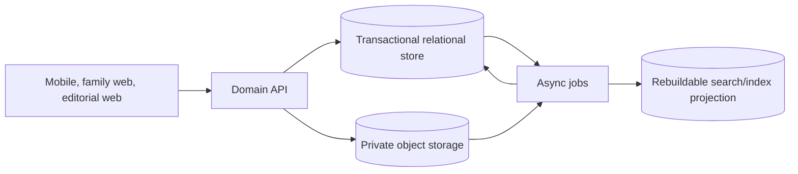

## 3. Logical conventions

These conventions are normative at the logical level; physical types remain undecided.

| Convention | Rule |
|---|---|
| Primary keys | Opaque, non-semantic `id`; UUID/ULID choice remains open |
| Public identifiers | Stable domain IDs such as `ACT-0001`, separate from primary keys |
| Time | UTC timestamps; family timezone stored separately for presentation/planning |
| Soft deletion | Not a universal substitute for deletion; use explicit lifecycle states and privacy deletion jobs |
| Locale | BCP 47 tags, initially `en-US` and `es-US` |
| Version | Semantic version plus schema version and content hash |
| Money | Integer minor units plus ISO currency code; never floating point |
| Quantities | Decimal value plus structured unit; conversions only within the same dimension |
| Audit | Actor, action, resource, request/correlation ID, and timestamp; no unnecessary child content |
| Concurrency | Revision number or ETag on mutable aggregates |
| Multi-tenancy | Every family-private resource resolves to a `family_id`; server authorization is mandatory |
| Encryption | Sensitive values and object keys protected according to classification; provider choice remains open |

## 4. Bounded contexts and schemas

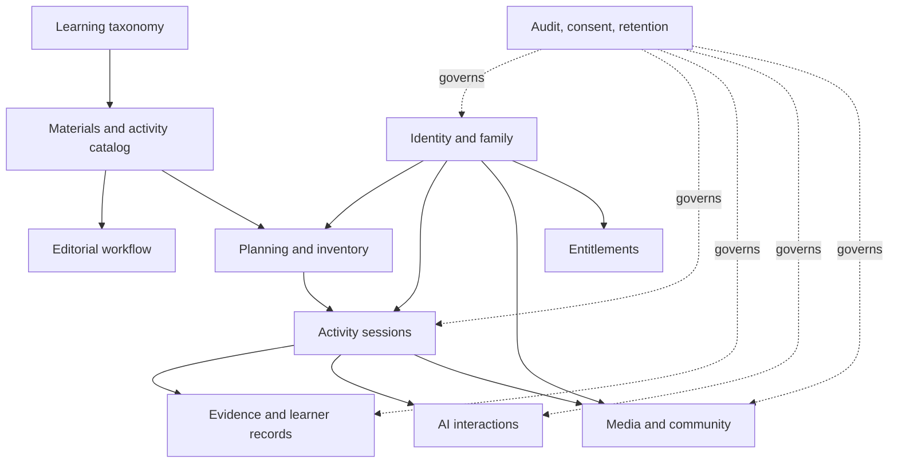

The names below are logical `snake_case` table names. A physical implementation may use bounded schemas or modules, but must preserve the ownership boundaries.

## 5. Identity and family

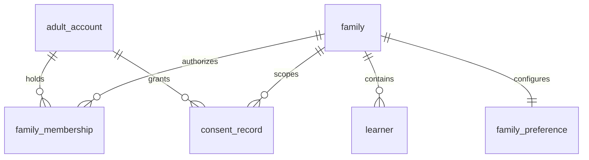

| Table | Key columns | Important constraints | Classification |
|---|---|---|---|
| `adult_account` | `id`, `auth_subject`, `display_name`, `email_reference`, `status`, timestamps | `auth_subject` unique; authentication secrets stay with auth provider | Private identity |
| `family` | `id`, `default_locale`, `unit_system`, `timezone`, `status`, `revision`, timestamps | locale and timezone required | Family private |
| `family_membership` | `id`, `family_id`, `adult_id`, `role`, `status`, `invited_by`, timestamps | unique `(family_id, adult_id)`; one or more active owners | Authorization |
| `family_preference` | `family_id`, time, space, mess, accessibility, content preferences, revision | one current aggregate per family | Family private |
| `learner` | `id`, `family_id`, `alias`, `age_band`, `preferred_locale`, `status`, timestamps | no full birth date by default; alias not globally unique | Child private |
| `learner_preference_signal` | `id`, `learner_id`, `context`, `signal`, `confidence`, provenance, status | provisional and correctable; never a fixed learning-style label | Child private |
| `consent_record` | `id`, `family_id`, `adult_id`, `purpose`, `scope`, `policy_version`, `decision`, timestamps, revocation | purpose-specific; one consent does not imply another | Contractual/private |

Family authorization is resolved through active membership on every request. A learner ID alone never grants access.

## 6. Learning taxonomy

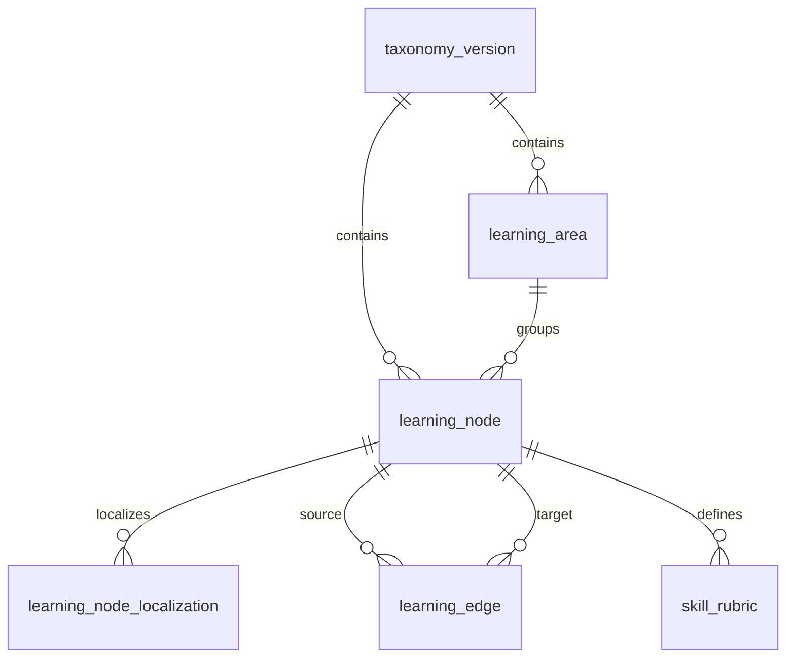

| Table | Key columns | Important constraints |
|---|---|---|
| `taxonomy_version` | `id`, `semantic_version`, `status`, `content_hash`, timestamps | version/hash unique; published versions immutable |
| `learning_area` | `id`, `taxonomy_version_id`, `code`, `status` | unique `(taxonomy_version_id, code)` |
| `learning_node` | `id`, `taxonomy_version_id`, `area_id`, `public_id`, `node_type`, `definition`, `status` | node type: concept/skill/functional_level; public ID unique within version |
| `learning_node_localization` | `node_id`, `locale`, `name`, `adult_explanation`, `child_explanation` | unique `(node_id, locale)` |
| `learning_edge` | `id`, `taxonomy_version_id`, `source_node_id`, `target_node_id`, `relationship`, `strength`, `rationale` | no self-edge; unique semantic edge per version |
| `skill_rubric` | `id`, `skill_node_id`, `scope`, `scope_ref`, `rubric_version`, `anchors`, `status` | scope identifies global or exact activity version |
| `rubric_observable` | `id`, `rubric_id`, `kind`, `localized_text`, `sort_order` | kind: evidence/non-evidence/external-factor |

Historical activity versions retain their taxonomy references. Publishing a new taxonomy version never silently rewrites old observations.

## 7. Material catalog and family inventory

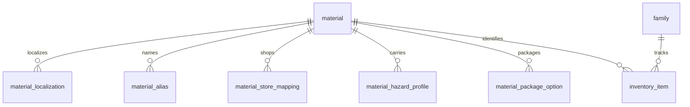

| Table | Key columns | Important constraints |
|---|---|---|
| `material` | `id`, `public_id`, `category`, `default_unit_id`, `consumability`, `status` | public ID unique; status controls new selection |
| `material_localization` | `material_id`, `locale`, `display_name`, `description`, search terms | unique `(material_id, locale)` |
| `material_alias` | `id`, `material_id`, `locale`, `region`, `alias` | aliases searchable but never used as identity |
| `store_section` | `id`, `region`, `code`, localized label, sort order | stable section code per region |
| `material_store_mapping` | `material_id`, `store_section_id`, priority | multiple possible stores allowed |
| `unit_definition` | `id`, `code`, `dimension`, symbols, conversion factor | unique code; dimension-safe conversions only |
| `material_package_option` | `id`, `material_id`, quantity, unit, package description | informational; no price required |
| `material_hazard_profile` | `id`, `material_id`, hazard category, condition, age/supervision bounds, source, review status | cannot approve an activity by itself |
| `material_equivalence_member` | `equivalence_class_id`, `material_id` | equivalence is not substitution approval |
| `inventory_item` | `id`, `family_id`, `material_id`, approximate state/quantity, confidence, updated_at | unique current item by family/material when appropriate |

## 8. Activity library and immutable versions

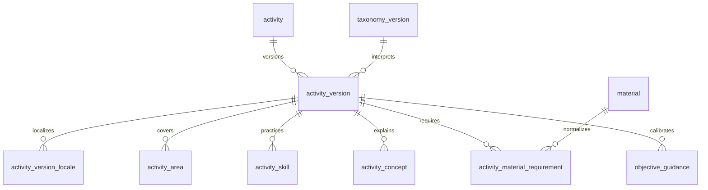

### 8.1 Core tables

| Table | Key columns | Important constraints |
|---|---|---|
| `activity` | `id`, `public_id`, `slug`, `canonical_working_title`, `source_kind`, timestamps | `public_id` and slug unique |
| `activity_version` | `id`, `activity_id`, `semantic_version`, `schema_version`, `taxonomy_version_id`, `status`, `content_hash`, `snapshot_payload`, timestamps, `supersedes_id`, retirement fields | unique `(activity_id, semantic_version)` and `content_hash`; immutable after pilot/publish boundary |
| `activity_version_locale` | `activity_version_id`, `locale`, title, summary, questions, explanations, completeness, reviewed hash | unique `(version, locale)`; required locales complete before US publication |
| `activity_suitability` | `activity_version_id`, age bounds, participant bounds, supported counts, levels, timing, environment, mess, offline capability | one per version; min ≤ max and counts within bounds |
| `activity_area` | `activity_version_id`, `area_id`, `kind` | exactly one primary; secondary unique |
| `activity_skill` | `activity_version_id`, `skill_node_id`, `practice_kind` | stable taxonomy reference; practice kind does not imply assessment |
| `activity_concept` | `activity_version_id`, `concept_node_id`, `presentation_kind` | unique per version/concept |
| `objective_guidance` | `id`, version, skill, age bounds, intent, localized rationale/simplification/extension | one or more rows per eligible skill; valid age range |
| `activity_material_requirement` | `id`, version, local requirement ID, normalized material, quantity/unit, required, consumable, preparation, safety notes | local ID unique within version |
| `material_substitution` | `id`, requirement, replacement material, quantity/unit, conditions, rationale, mechanism equivalence, safety impact, approval ref | exact-version approval required |

### 8.2 Snapshot rule

Normalized child tables support editorial queries and constraints. `snapshot_payload` is the canonical, schema-valid serialization compiled from them. At compile time:

1. lock the draft revision;
2. resolve every reference;
3. serialize deterministically;
4. validate schema and domain invariants;
5. compute the content hash;
6. bind every review to version and hash;
7. store the immutable snapshot.

The snapshot is not an unvalidated JSON dumping ground. Normalized source and snapshot must be reconcilable through a compiler version and build record.

## 9. Narrative, roles, steps, and safety

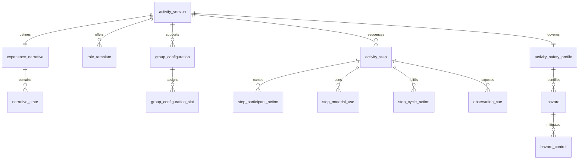

| Table | Key columns | Important constraints |
|---|---|---|
| `experience_narrative` | `activity_version_id`, mode, starting/ending state, completion policy | one per version |
| `narrative_state` | `id`, version, local state ID, localized description | local ID unique within version |
| `material_function` | requirement, introduced step, localized purpose | every required material has one |
| `participant_cycle_requirement` | version, action, audience, required | essential actions unique per version |
| `role_template` | `id`, version, local role ID, localized name/contribution, compatible levels | local role ID unique within version |
| `role_skill_mapping` | role, skill, mapping kind | kind: eligible_primary/exposure |
| `role_concept_exposure` | role, concept | unique role/concept |
| `role_step_permission` | role, step, permission | allowed/restricted; no contradiction |
| `role_responsibility` | role, localized text, sort order | ordered and non-empty |
| `group_configuration` | `id`, version, participant count, localized notes | unique participant count per version |
| `group_configuration_slot` | configuration, slot number, role template | one slot per participant |
| `activity_step` | `id`, version, local step ID, sequence, stage, actor, entry/exit states, localized content, minutes, warning/resume | local ID and sequence unique; continuous states |
| `step_adult_action` | step, sort order, localized action | at least one per step |
| `step_facilitator_prompt` | step, sort order, localized prompt | at least one per step |
| `step_participant_action` | local action ID, step, audience, action, turn order | role refs required for role audience |
| `participant_action_role` | participant action, role | junction table |
| `step_material_use` | step, material requirement, localized purpose | material introduced before use |
| `step_cycle_action` | step, action, audience | ordered coverage of required cycle |
| `observation_cue` | `id`, step, skill, localized behavior and do-not-infer | cue skill belongs to version |
| `step_problem_solution` | `id`, step, localized problem/safe response, sort order | safe response required |
| `activity_safety_profile` | version, participation level, supervision, cleanup | one per version |
| `hazard` | `id`, profile, local hazard ID, category, localized description, exposed actor | local ID unique within version |
| `hazard_control` | hazard, step/material refs, actor, localized control, verification | at least one per hazard |
| `adult_only_step` | profile, step, localized reason | exact step reference |
| `stop_condition` | `id`, profile, localized signal and response, sort order | at least one per version |
| `prohibited_adaptation` | `id`, profile, localized change and rationale | at least one per version |

## 10. Adaptations, assessment, and visuals

| Table | Key columns | Important constraints |
|---|---|---|
| `adaptation_option` | `id`, version, local ID, type, localized name/conditions/changes, safety impact, confirmation flag, approval ref | exact version; no unapproved safety increase |
| `adaptation_step` | adaptation, step, operation/order | structured extension/simplification when steps change |
| `observation_prompt` | `id`, version, skill, localized question, rubric ref | one per eligible primary skill |
| `observation_prompt_example` | prompt, kind, localized text, sort order | evidence/non-evidence/external-factor |
| `visual_brief` | `id`, version, local ID, asset version, type, style, purpose, alt text, source/rights refs | local ID unique; linked step required where applicable |
| `visual_brief_step` | visual brief, step | exact version refs |
| `visual_candidate` | `id`, brief, source/provider/model, prompt revision, object key, checksum, status | internal content |
| `visual_qa_result` | `id`, candidate, tool/version, findings, result, timestamp | automated result cannot approve |
| `visual_asset` | `id`, candidate, object key, MIME, dimensions, checksum, status | approved asset immutable; binary in object storage |
| `rights_record` | `id`, subject type/id, basis, owner/licensor, scope, territory, term, attribution, evidence object key | required before publication |
| `visual_approval` | `id`, asset, reviewer, activity version/hash, decision, timestamp | exact content hash |

## 11. Editorial workflow and provenance

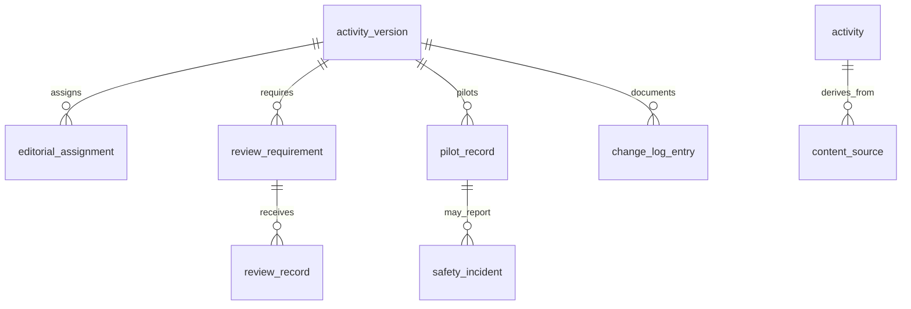

| Table | Key columns | Important constraints |
|---|---|---|
| `editorial_user` | internal user/identity ref, status | separated from family role |
| `editorial_role_assignment` | user, role, scope, status, dates | least privilege |
| `editorial_assignment` | activity/version, user, responsibility, due date, status | workflow only |
| `content_source` | activity, source kind, title/provider/URL, retrieval date, license status, notes | provenance required for external sources |
| `source_license_record` | source, license, allowed uses, modifications, attribution, territory, term, evidence | legal review state required |
| `review_requirement` | version, gate, reason, required role, status | derived from category/risk but persisted for audit |
| `review_record` | requirement, reviewer, role, decision, reviewed version/hash, findings, timestamp | append-only; exact hash |
| `pilot_record` | version, facilitator kind, participant count, age bands, duration, outcome, family pseudonymous ref, timestamp | no unnecessary child identity |
| `pilot_finding` | pilot, category, severity, description, disposition | internal content |
| `narrated_walkthrough` | version/hash, reviewer, participant count, result, findings, timestamp | required before pilot gate |
| `safety_incident` | version/pilot/session ref, severity, facts, response, status, timestamps | tightly restricted and auditable |
| `change_log_entry` | version, entry ID, semantic version, localized summary, timestamp | append-only |
| `publication_record` | version/hash, publisher, decision, effective timestamp | one effective publication per decision |
| `retirement_record` | version, actor, reason, replacement version, effective timestamp | immediately updates eligibility |
| `editorial_comment` | version, field/step/resource ref, author, body, status, timestamps | optimistic concurrency and audit |
| `editorial_build` | draft revision, compiler version, snapshot hash, validation result, timestamp | reconciles normalized source to snapshot |

## 12. Planning and shopping

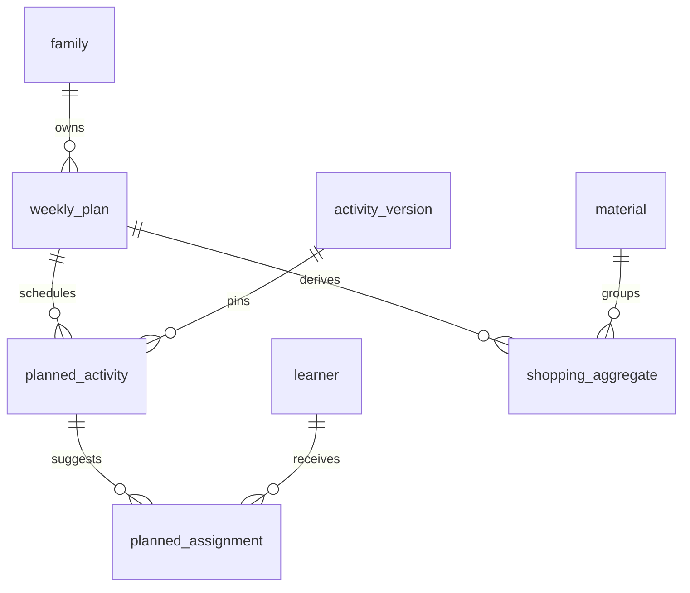

| Table | Key columns | Important constraints |
|---|---|---|
| `weekly_plan` | `id`, family, start date, locale, timezone, status, rule version, revision, timestamps | one active revision as product defines |
| `plan_day` | plan, local date, available minutes, status | unique date per plan |
| `planned_activity` | `id`, day, activity version, order, estimated duration, explanation, status | exact version only |
| `planned_participant` | planned activity, learner, participation status | authorized family learner |
| `planned_assignment` | planned activity, learner, role template, primary skill, intent, explanation | at most one active primary objective per learner/activity |
| `shopping_aggregate` | plan, material, total quantity/unit, aggregation mode, store section, likely-at-home flag | unique normalized material/unit grouping |
| `shopping_source` | aggregate, planned activity, quantity/unit | complete provenance by day/activity |
| `shopping_check_state` | aggregate, adult/family, checked, timestamp | family-private mutable state |

Consumables sum across activities. Reusable tools use the maximum simultaneous quantity, not the weekly sum.

## 13. Sessions and offline synchronization

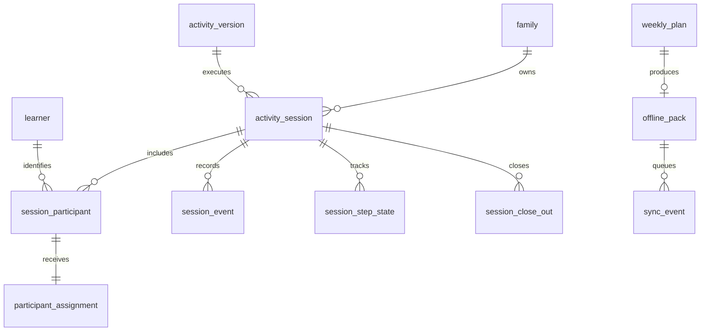

| Table | Key columns | Important constraints |
|---|---|---|
| `activity_session` | `id`, family, activity version/hash, delivery mode, locale, status, revision, timestamps, context | exact immutable version; valid state transitions |
| `session_participant` | `id`, session, learner, participation status, joined/left times | unique `(session, learner)` |
| `participant_assignment` | participant, planned/actual role, primary skill, reason, status, timestamps | at most one active assignment and primary skill |
| `assignment_history` | assignment, prior/new role/objective, reason, actor, timestamp | append-only; changes are contextual, not negative evidence |
| `session_step_state` | session, step, status, started/completed timestamps, applied adaptation | exact step/adaptation refs |
| `session_event` | `id`, session, event type, idempotency key, occurred/received times, actor, payload, base revision | idempotency unique within client scope |
| `session_close_out` | `id`, session, participant, disposition, primary rating, skip reason, timestamp | exactly one disposition per participant; rating 0..1 |
| `secondary_rating` | close-out, skill, rating, source | only through **Evaluate more** |
| `offline_pack` | `id`, family, plan, manifest version/hash, locale, created/expires, status, encrypted key ref | exact version/assets; expiry required |
| `offline_pack_item` | pack, resource type/id/version/hash, local path/size | complete manifest integrity |
| `sync_event` | client event ID, family/device/session, base revision, event type, payload, status, conflict fields, timestamps | globally idempotent for client scope |
| `sync_conflict` | sync event, server revision, conflict type, resolution, actor, timestamp | no silent assessment overwrite |

## 14. Evidence and Learner Model

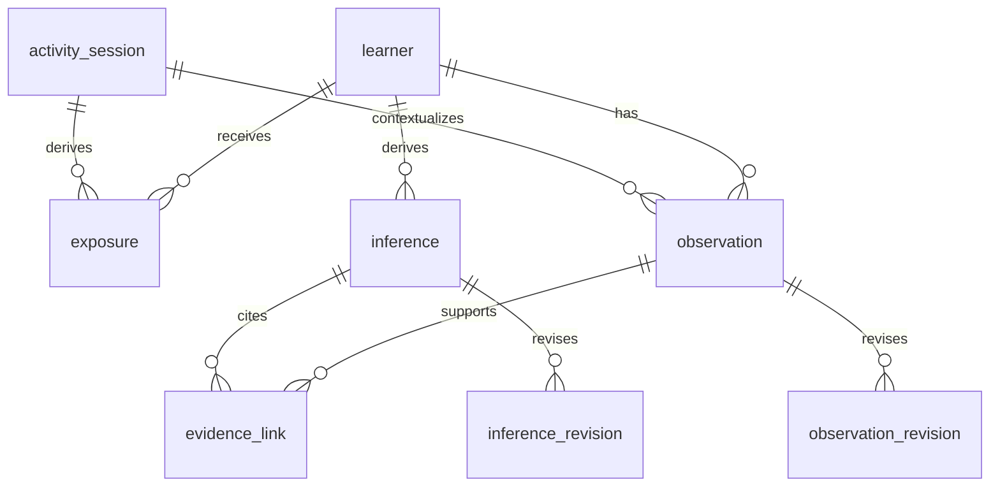

| Table | Key columns | Important constraints | Classification |
|---|---|---|---|
| `exposure` | `id`, learner, session, skill/concept, source step/role, occurred_at | no performance/rating field; no nonparticipant exposure | Child private |
| `observation` | `id`, learner, session, source type/ref, skill, structured fact, rating when applicable, state, occurred/created times, creator | rating required only for rating source; provenance required | Child private |
| `observation_revision` | observation, revision, supersedes, corrected fields, reason, actor, timestamp | append-only correction chain | Child private |
| `evidence_link` | `id`, observation, inference, skill, context relevance, status | same learner/skill; rejected evidence excluded | Derived child data |
| `inference` | `id`, learner, skill, state, confidence, explanation, generated/updated times, model/rule version | non-empty evidence unless insufficient-evidence state | Derived child data |
| `inference_revision` | inference, revision, prior/new state/confidence/explanation, reason, actor/model, timestamp | reconstructable history | Derived child data |
| `interest_signal` | learner, session/context, signal, source, confidence, status | separate from skill and independence | Child private |

An exposure never becomes evidence of independence. Ratings are contextual and never averaged into a global score.

## 15. AI companion, temporary inputs, and provider audit

| Table | Key columns | Important constraints |
|---|---|---|
| `companion_interaction` | `id`, family, adult, mode, session/version/step refs, status, created_at | authorized context only |
| `companion_request` | interaction, capability, redacted context manifest, provider deployment, policy version | avoid storing full prompt by default |
| `companion_response` | interaction, structured action, safety status, uncertainty, confirmation requirement, timestamps | validated schema required |
| `provider_deployment` | provider/model, region, capabilities, allowed data classes, retention/training terms, status | approved registry controls routing |
| `ai_audit_event` | interaction, action, rule/tool refs, outcome, timestamp | no unnecessary child content |
| `transcript` | media asset, editable text, status, expires_at, corrected_by | maximum proposed retention 30 days |

## 16. Media, private portfolio, and community

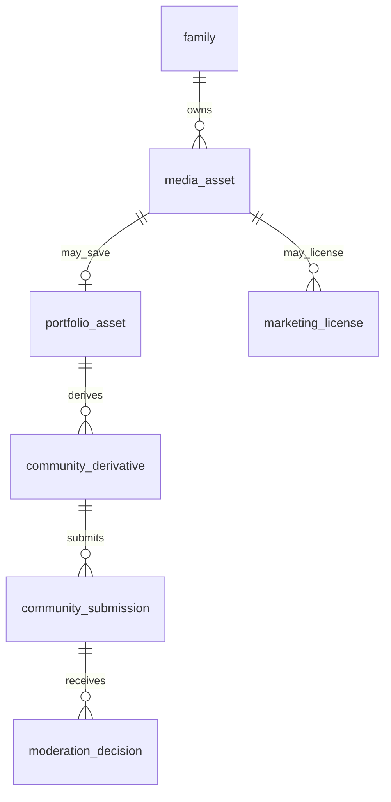

| Table | Key columns | Important constraints |
|---|---|---|
| `media_asset` | `id`, family, adult owner, purpose, object key, checksum, MIME, sensitivity, retention state, expires_at | purpose and expiry required; binary outside DB |
| `media_processing_job` | asset, job type, provider, status, attempts, idempotency, timestamps | purpose-bound provider access |
| `portfolio_asset` | asset, family, activity/session refs, saved_by, status, timestamps | explicit save action |
| `community_derivative` | source portfolio asset, object key, metadata-removal result, face/text detections, checksum | distinct from private original |
| `community_submission` | derivative, activity version, adult uploader, caption, visibility, moderation status, timestamps | adult-only, exact activity version |
| `moderation_decision` | submission, moderator, decision, reason, policy version, timestamp | append-only audit |
| `community_report` | submission, reporter, category, status, timestamps | no access to learner records |
| `marketing_license` | asset/derivative, adult grantor, scope, channels, term, status, revocation | independent of community permission |

## 17. Subscription entitlements

| Table | Key columns | Important constraints |
|---|---|---|
| `subscription_entitlement` | `id`, family, source channel, external customer/subscription refs, product, status, period/trial/grace dates, payer adult | one effective entitlement policy per family |
| `billing_event` | provider event ID, channel, received/processed times, type, payload hash, status | idempotent provider event |
| `purchase_receipt` | channel, opaque receipt reference, family, verification status, timestamps | do not expose payment details to other adults |
| `entitlement_revision` | entitlement, prior/new state, source event, timestamp | append-only |

Payment card data remains with Apple, Google, or Stripe and does not belong in this database.

## 18. Governance, audit, retention, and deletion

| Table | Key columns | Important constraints |
|---|---|---|
| `audit_event` | `id`, actor type/id, family scope, action, resource type/id, result, correlation ID, timestamp | append-only, content-minimized |
| `access_grant` | subject, resource scope, capability, granted/revoked times, actor | supports exceptional/support access |
| `support_access_session` | support actor, purpose, approved scope, expires_at, audit refs | time limited |
| `retention_rule` | data class, purpose, trigger, duration, policy version, status | versioned policy configuration |
| `deletion_request` | requester, family/learner/resource scope, status, verification, timestamps | explicit scope and authorization |
| `deletion_task` | request, subsystem/object/index target, status, attempts, verification evidence | propagates deletion |
| `export_request` | requester, family scope, status, object key, expires_at | encrypted temporary export |
| `legal_hold` | scope, authority, start/end, notes, status | exceptional and restricted |

## 19. Required database invariants

- **DB-001:** Every family-private record resolves to exactly one family authorization boundary.
- **DB-002:** Every activity session pins an exact activity version and content hash.
- **DB-003:** Published and retired activity snapshots are immutable.
- **DB-004:** One participant has at most one active primary objective per session.
- **DB-005:** A completed session has exactly one close-out disposition per participant.
- **DB-006:** A nonparticipant has no derived exposure or rating.
- **DB-007:** Exposure contains no performance, independence, mastery, or score field.
- **DB-008:** An inference is traceable to valid evidence from the same learner and skill, except explicit insufficient-evidence state.
- **DB-009:** Corrections and rejections preserve an append-only provenance chain.
- **DB-010:** A retired activity version remains resolvable historically but is excluded from new recommendations immediately.
- **DB-011:** Every deliverable adaptation, substitution, visual, and review references the exact version/hash it approves.
- **DB-012:** Media has a declared purpose, family owner, retention state, and expiration where temporary.
- **DB-013:** Community publication and marketing license are independent records.
- **DB-014:** Provider webhooks, offline events, close-out, and media jobs are idempotent.
- **DB-015:** Search, recommendation, coverage, and shopping projections can be rebuilt from canonical records.
- **DB-016:** Client input cannot set final eligibility, publication, entitlement, confidence, or authorization state.
- **DB-017:** Deletion propagates to objects, indexes, caches, and derived records according to a verifiable task graph.
- **DB-018:** Audit logs contain internal references and outcomes, not raw child media or full AI prompts by default.
- **DB-019:** Every mutable aggregate has an explicit revision for optimistic concurrency.
- **DB-020:** Schema migrations preserve exact historical activity/session/evidence interpretation.

## 20. Index and query requirements

These are logical indexes; exact syntax depends on the selected engine.

| Query | Required access path |
|---|---|
| Resolve exact activity version | unique activity ID + semantic version; content hash |
| Eligible catalog | status/market/locale + age + participant count + timing + safety level |
| Material shopping | plan + normalized material + unit + aggregation mode |
| Family authorization | active membership by adult/family |
| Session resume | family + session status + updated time |
| Idempotent event | client/device scope + idempotency key |
| Learner Journey | learner + occurred time; learner + skill + status |
| Inference provenance | inference → evidence links → observations |
| Retention jobs | lifecycle status + expiration time |
| Editorial queues | version status + required gate + assignment/due date |
| Version retirement | published eligibility pointer and status |
| Audit investigation | resource/actor/family scope + timestamp |

Free-text search by locale should use a rebuildable search document. It must not index family-private or child-private content into the public catalog index.

## 21. JSON Schema mapping

| JSON contract | Canonical persistence source |
|---|---|
| `ActivityVersion` | catalog, narrative, roles, steps, safety, adaptations, visuals, and editorial tables compiled into immutable snapshot |
| `ActivitySession` | session, participants, assignments, progress/events, close-out, and offline state |
| `LearnerRecords` | exposures, observations/revisions, evidence links, inferences/revisions |
| `OfflinePackManifest` | offline pack and item records generated from exact plan/version/assets |
| `SyncEvent` | sync event envelope and conflict records |

JSON contracts define external or aggregate shape. Relational tables enforce identity, authorization, workflow, query, and lifecycle concerns. Neither representation replaces domain validation.

## 22. Transaction boundaries

The following operations should be atomic within one database transaction where supported:

- create family and initial owner membership;
- publish a version and update catalog eligibility;
- retire a version and remove it from new eligibility;
- create a session with participants and assignments;
- apply an idempotent session event and advance revision;
- complete close-out and create primary observations/exposures;
- correct an observation and invalidate/recalculate affected inference state;
- process a billing event and update entitlement;
- grant/revoke membership or support access;
- register community moderation decision and visibility state.

Media upload/processing, AI calls, emails, and search indexing occur through durable jobs/outbox events rather than holding the transaction open.

## 23. Domain event outbox

Use a logical `domain_event_outbox` record containing event ID, aggregate type/ID, aggregate revision, event type, minimal payload, occurred time, publish status, and attempt metadata. It supports reliable work such as:

- rebuilding catalog indexes;
- creating offline packs;
- inference recalculation;
- media deletion;
- entitlement notifications;
- activity retirement propagation;
- audit/reporting pipelines.

Event payloads use references and minimum necessary fields; consumers fetch authorized detail when needed.

## 24. Physical decisions still open

The following require explicit approval before migrations are written:

1. Database engine and version.
2. Tenant isolation strategy and whether row-level security is used.
3. ID type and generation strategy.
4. Schema/namespace layout for bounded contexts.
5. ORM/query layer and migration tool.
6. JSON snapshot storage type and canonical serialization implementation.
7. Search provider or database-native search.
8. Object storage, malware scanning, encryption, and region.
9. Authentication provider and mapping to `adult_account.auth_subject`.
10. Backup, point-in-time recovery, deletion propagation, and audit retention.
11. Analytics store and privacy thresholds.
12. High-availability, connection-pooling, and job/outbox implementation.

## 25. Recommended implementation order

1. Taxonomy, material, activity, immutable version, and publication-read model.
2. Adult account, family, membership, and learner authorization.
3. Session, participant assignment, primary objective, and close-out.
4. Exposure, observation, evidence link, inference, and corrections.
5. Planning, shopping aggregation, offline packs, and sync events.
6. Editorial workflow, provenance, reviews, pilots, and visual pipeline.
7. AI interactions and temporary media.
8. Entitlements, portfolio, and post-MVP community.

This order follows the vertical slices; it does not authorize a family-delivered activity before the publication gates are complete.
