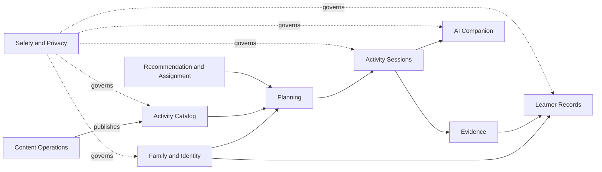

> **Canonical English document.** This document is normative from 18 August 2026 under `DEC-052`. The Spanish [historical record](../../historical/es/docs/07-engineering/architecture.md) is retained for traceability; all new requirements, decisions, and changes belong in English.

# Conceptual architecture

**Status:** Draft
**Version:** 1.0

## Objective

Define system boundaries before choosing an implementation stack. The final technical architecture still requires explicit decisions for runtime, database, authentication, hosting, storage, and mobile framework.

## Bounded contexts

## Logical components

### Family app

Onboarding, planning, activity facilitation, close-out, Learning Journey, and privacy controls.

### Editorial application

Authoring, review, pilot, publication, retirement, and visual-asset workflows.

### Domain API

Exposes family, catalog, planning, session, evidence, entitlement, media, and editorial capabilities with consistent resource-level authorization.

### Deterministic engines

Eligibility, safety filters, compatible assignments, evidence rules, and publication invariants. These engines must work and be testable without AI generation.

### AI Layer

Orchestrates general-purpose models with structured context, bounded tools, and validated outputs. It is not a source of truth.

The layer uses an internal gateway and a provider/capability registry. A provider may receive child-related data only when its deployment is explicitly approved for the data class, region, retention policy, and use case.

### Persistence

Transactional data, immutable versioned content, temporary media, and audit records are separated according to sensitivity and lifecycle.

## Fundamental rule

Critical decisions do not depend solely on generated text:

- Publication and safety: deterministic rules and verifiable status.
- Authorization: server-side resource policies.
- One primary objective: domain and persistence constraints.
- Retention: scheduled jobs and verifiable lifecycle metadata.
- Adaptations: identifiers of approved options from the exact activity version.

## Initial approach

For the pilot, a modular monolith with a transactional database and separate object storage is recommended. It reduces operational complexity while preserving domain boundaries. Microservices require demonstrated scale, security, or organizational need.

The final-project implementation realizes this boundary with a React/TypeScript/Vite family PWA, a FastAPI domain/AI service, Supabase Auth/PostgreSQL/pgvector/RLS, OpenRouter, Logfire and separate Vercel deployments. See [Production runtime](production-runtime.md).

The primary client will be an iOS/Android mobile application. The native or cross-platform framework remains undecided pending validation of background sync, camera, audio, shopping, and accessibility requirements. Family web and editorial web experiences are also planned.

## Resilience

- The published guide must be available without AI.
- A session saves local or recoverable progress.
- A downloaded weekly pack contains immutable assigned activity versions and does not depend on an AI model for delivery.
- Voice/photo jobs are idempotent.
- Publishing or retiring content invalidates eligibility caches.
- An analytics failure does not block the product.

## Observability

- Domain events without unnecessary child content.
- Audit access, publication, correction, and deletion.
- Latency and error metrics by AI mode.
- Traces with internal references, not complete prompts by default.

## Remaining production decisions

- Final native mobile framework after the web pilot.
- Approved Supabase/Vercel regions for represented pilot states.
- Account-recovery support procedure beyond Supabase magic-link recovery.
- Voice, image and object-storage providers for later releases.
- Background sync and local-encryption implementation.
- App Store/Google Play entitlement integration and future Stripe web purchase.
