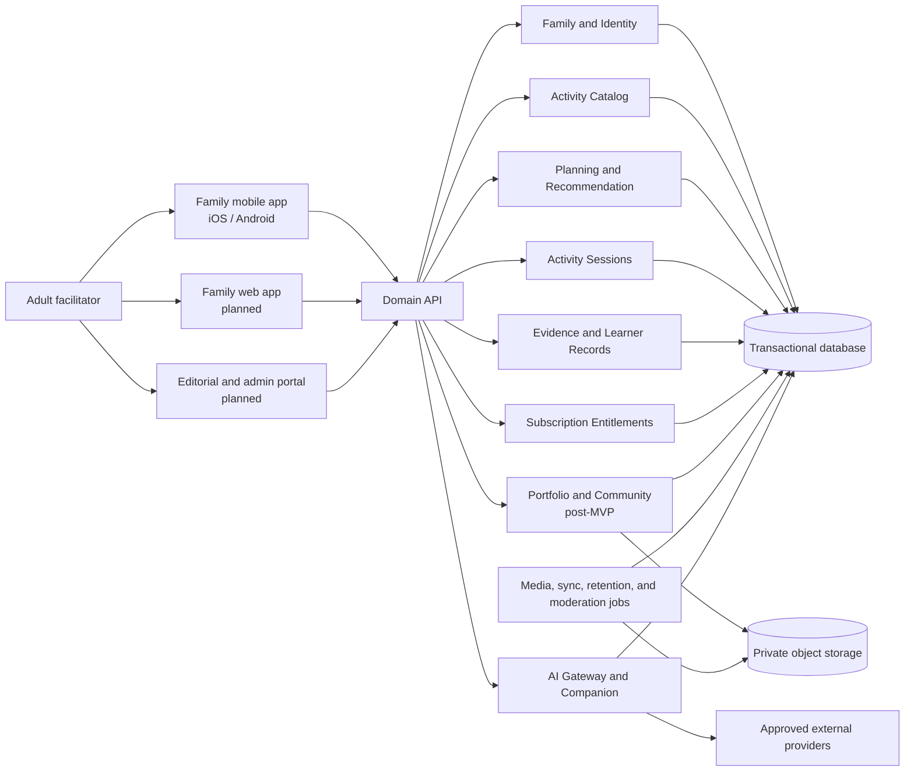
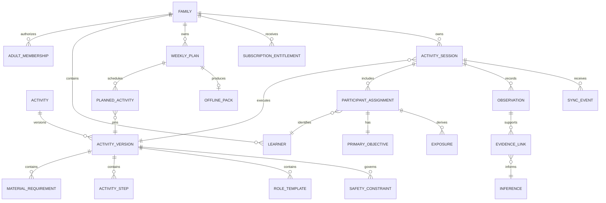
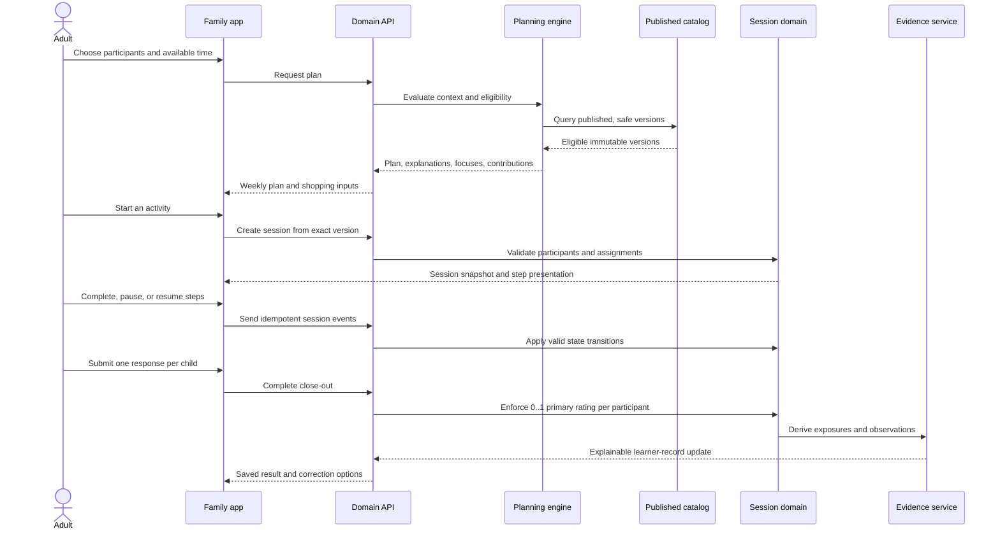

# Backend Collaboration Handoff

**Status:** Review  
**Version:** 0.1  
**Audience:** backend collaborator, frontend owner, and future technical reviewers  
**Normative language:** English under `DEC-052`

## Purpose

This document is the shared starting point for backend implementation. It explains what the product is, what already exists, how responsibilities are divided, which contracts are authoritative, and what remains undecided.

It does not approve a production stack or turn any `Draft` activity into family-deliverable content. Detailed requirements remain in the linked specifications; this handoff is the implementation map.

## Product in one paragraph

Kids Learning System is an adult-led learning companion for families with children ages 5–10. It uses a reviewed, versioned activity library to turn ordinary household materials into hands-on learning. The system recommends activities for the family's available time and context, suggests one primary learning focus per participating child, guides the adult through the activity, records lightweight observations, and builds explainable—not diagnostic—learning history. The first market is the United States and the product is bilingual in `en-US` and `es-US`.

## Current implementation state

| Area | Exists now | Does not exist yet |
|---|---|---|
| Product and domain | Canonical English specifications, stable requirement IDs, decision log, and traceability | Final architecture decisions and production approval |
| Contracts | Five JSON Schemas, six positive examples, cross-document domain validation, and negative fixtures | Versioned production API and generated client types |
| Family experience | Bilingual installable static PWA prototype covering a five-day founder dry run | Accounts, real family data, server persistence, cross-device sync, and production mobile client |
| Content | Three detailed calibration activities and three additional dry-run candidates | A published production catalog; every current activity is `Draft` or candidate content |
| Backend | Platform-neutral capability and data specifications | Authentication, database, APIs, engines, jobs, billing, media pipeline, and AI gateway |
| Deployment | Public GitHub Pages fixture deployment for the founder only | Private/authenticated pilot environment and production hosting |

The current prototype is intentionally synthetic and local-only. It must not receive real child photos, voice, payments, or sensitive observations.

## Sources of truth

Read in this order before implementing a backend change:

1. [Repository README](../README.md)
2. [Product principles](00-foundation/product-principles.md) and [glossary](00-foundation/glossary.md)
3. [Product requirements](03-product/requirements.md)
4. [Specification map](SPECIFICATION-MAP.md)
5. The affected domain specification
6. [Decision log](08-delivery/decision-log.md), [open questions](00-foundation/open-questions.md), and [traceability](08-delivery/traceability.md)
7. [Machine-readable contracts](../schemas/README.md)
8. [Vertical slices](08-delivery/vertical-slices.md)

When sources conflict, physical safety and privacy come first, followed by approved decisions, principles, domain specifications, flows, and user stories. Do not resolve a meaningful contradiction with an undocumented assumption.

## System context



The preferred conceptual shape for the pilot is a modular monolith with explicit domain boundaries, one transactional store, separate object storage, and asynchronous jobs where required. This is a documented direction, not a final framework or vendor decision.

## Frontend–backend responsibility split

| Frontend owner | Backend collaborator | Shared contract |
|---|---|---|
| Mobile and family-web presentation | Identity, family membership, and authorization | Auth/session semantics and permission errors |
| Adult-facing activity facilitation | Published catalog queries and immutable activity versions | `ActivityVersion` schema and localized content contract |
| Plan, shopping, preparation, and session UI | Eligibility, recommendation, assignment, and planning rules | Recommendation explanation and assignment DTOs |
| Offline interaction and pending-state UX | Offline pack creation, idempotent event ingestion, and conflict resolution | `OfflinePackManifest` and `SyncEvent` schemas |
| Fast close-out UI | Session state machine, primary-rating invariant, observations, and evidence | `ActivitySession` and `LearnerRecords` schemas |
| Journey and correction UI | Explainable inference generation, provenance, and correction history | Evidence links, confidence vocabulary, and audit events |
| Bilingual rendering and accessibility | Locale negotiation and localized payload integrity | Stable IDs plus `en-US`/`es-US` fields |
| Purchase and entitlement screens | Store/Stripe receipt handling, webhooks, grace state, and restoration | Entitlement state model |
| Media capture and consent screens | Upload authorization, metadata removal, retention, moderation, and deletion | Purpose-specific upload and retention contracts |

Neither side should duplicate safety, eligibility, publication, authorization, or evidence rules in presentation code. The backend enforces them; the frontend explains their results and preserves adult control.

## Canonical domain model



Core invariants:

- A family-delivered session references one exact published `ActivityVersion`.
- Each participating learner has at most one primary objective in a session.
- Exposure records opportunity, never performance or mastery.
- A completed session has an explicit close-out disposition for every participant.
- Inferences are derived, uncertain, explainable, correctable, and linked to evidence.
- Family authorization is checked server-side for every child-related resource.
- Safety and publication states are deterministic rules, not AI judgments.
- Media purpose, retention, and deletion are separate from educational observations.

## Primary activity flow



## Backend build order

Implementation should follow vertical slices rather than building isolated layers.

### 0. Contract and stack decision gate

- Confirm runtime/framework, database, authentication provider, deployment region, object storage, API style, and migration strategy.
- Record approved choices in the decision log before introducing them as dependencies.
- Freeze the first consumer-facing contract version and generate shared types where practical.
- Keep fictional fixtures separate from seed data that could ever reach a family.

### 1. VS-01 — Family identity and published catalog

- Adult authentication and minimal family creation.
- Owner-managed adult membership.
- Learner profile using alias and age range rather than full birth date.
- Read-only published catalog with exact immutable version retrieval.
- Authorization, audit, and retired-version eligibility tests.

### 2. VS-02 — Assignments and primary objectives

- Participant selection for 1–4 children.
- Deterministic role/focus compatibility.
- At most one primary objective per participant.
- Suggested contribution and explanation payloads.
- Nonparticipation and changed-participation events without negative evidence.

### 3. VS-03 — Session and close-out

- Session lifecycle: create, start, pause, resume, complete.
- Exact activity-version and assignment snapshots.
- One default rating per child, optional **Evaluate more**, optional text/voice-derived observation.
- Close-out disposition for skipped, not observed, or did not participate.
- Domain tests for duplicate ratings, missing close-out, and invalid state transitions.

### 4. VS-04 — Explainable Learning Journey

- Exposure, observation, evidence-link, and inference persistence.
- Confidence and uncertainty compatible with the evidence available.
- “Why?” provenance, correction, rejection, and audit history.
- No scores, diagnoses, intelligence claims, or sibling comparisons.

### 5. VS-05 and VS-09 — Planning and offline sync

- Time-based weekly plan and consolidated shopping rules.
- Immutable offline-pack manifest with hashes and expiry.
- Encrypted local queue contract, idempotency keys, base revisions, and conflict resolution.
- Reconnect without duplicated assessments or silent data loss.

### 6. VS-06 and VS-07 — Bounded AI and optional voice

- Provider-agnostic gateway with an approved deployment registry by data type.
- Structured context, tool limits, output validation, and deterministic fallback.
- Temporary audio processing, editable transcript, and purpose-based retention.
- No AI-created safety changes, publication, or unsupported child conclusions.

### 7. Later slices

- `VS-08`: collaborative editorial workflow and independent publication gates.
- `VS-10`: generated visual candidates, QA, human approval, and version binding.
- `VS-11`–`VS-12`: private portfolio and moderated adult-only community.
- Subscription entitlement can be developed alongside the first private pilot, but commercial charging begins only after the distribution and compliance gates pass.

## API capability groups

The current [API contract](07-engineering/api-contracts.md) defines capabilities, not final URLs. The backend must eventually expose:

- Family, adult membership, learner profile, preferences, inventory, export, and deletion.
- Subscription entitlement, purchase restoration, channel webhooks, grace state, and management links.
- Published catalog, exact versions, materials, substitutions, adaptations, and safety controls.
- Recommendation, explanation, replacement, weekly plan, and shopping aggregation.
- Session lifecycle, assignments, participation changes, steps, close-out, and offline synchronization.
- Exposure, observation, evidence, inference, correction, and rejection.
- Bounded companion interactions and temporary uploads.
- Editorial draft, review, pilot, publish, retire, visual QA, and audit operations.
- Later: private portfolio, community submission, moderation, report, takedown, and separate marketing consent.

Every mutating operation should be designed for resource-level authorization, readable domain errors, auditability, and idempotency where retries are expected.

## Machine-readable contracts

| Contract | Purpose | Current status |
|---|---|---|
| [`ActivityVersion`](../schemas/v0.1/activity-version.schema.json) | Immutable content, narrative, mappings, safety, adaptations, visuals, and editorial gates | Draft; validated example and domain invariants exist |
| [`ActivitySession`](../schemas/v0.1/session.schema.json) | Participants, assignments, lifecycle, exposures, close-out, and offline state | Draft; 1/2/3-participant fixtures exist |
| [`LearnerRecords`](../schemas/v0.1/learner-records.schema.json) | Exposures, observations, evidence, inferences, and corrections | Draft; evidence invariants exist |
| [`OfflinePackManifest`](../schemas/v0.1/offline-pack-manifest.schema.json) | Versioned content and assets for offline execution | Draft |
| [`SyncEvent`](../schemas/v0.1/sync-event.schema.json) | Idempotent client-event envelope and conflict handling | Draft; normal and conflict examples exist |

Run `npm install` once and `npm run validate` before proposing a contract change. JSON Schema validation does not replace publication, safety, authorization, or cross-document domain validation.

## Decisions still required before production coding

The following are intentionally unresolved and must not be hidden inside an implementation PR:

- Backend language and framework.
- Database engine, tenancy model, migration tool, and region.
- Adult authentication and account-recovery provider.
- API style and client type-generation strategy.
- Object storage, upload scanning, and media-processing vendors.
- Production hosting and observability stack.
- Mobile implementation framework and background-sync constraints.
- Exact App Store, Google Play, and future Stripe entitlement architecture.
- Legal/privacy requirements for the pilot states and recognizable child media.

Other product questions—pricing, first web experience, Apple Kids Category strategy, and the conductivity tester gate—remain in [open questions](00-foundation/open-questions.md).

## Repository map

```text
docs/                         Canonical English product and engineering source
historical/es/                Frozen Spanish historical records
schemas/v0.1/                 Draft machine-readable domain contracts
schemas/examples/             Fictional positive and conflict fixtures
scripts/                      Schema, domain, and documentation validators
prototypes/family-mobile-v0.1 Static bilingual founder-pilot PWA
.github/workflows/            Current GitHub Pages deployment workflow
```

## First backend pull request checklist

- [ ] Names the vertical slice and requirement IDs it advances.
- [ ] References relevant decisions and open questions.
- [ ] Does not introduce an unapproved vendor or framework silently.
- [ ] Adds resource-level authorization and negative tests.
- [ ] Preserves immutable activity-version references.
- [ ] Enforces one primary objective and close-out invariants server-side.
- [ ] Uses fictional test data and logs no unnecessary child content.
- [ ] Updates schemas, examples, traceability, and the decision log when required.
- [ ] Runs `npm run validate` and the new implementation tests.

## Recommended first collaboration session

The frontend owner and backend collaborator should jointly decide the stack gate, then define the smallest end-to-end `VS-01` contract: authenticate one adult, create one family, add one learner using an age range, retrieve one truly published test activity, and open its immutable guide. That produces a real integration seam without prematurely implementing AI, community, or complex learning inference.
