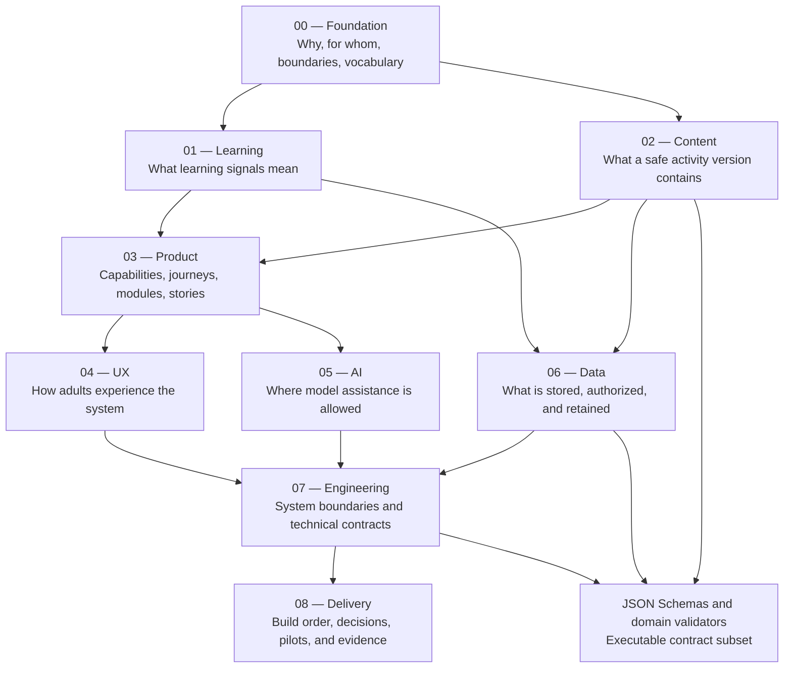

# Specification Map

**Status:** Review  
**Version:** 0.1  
**Normative language:** English under `DEC-052`

## Purpose

This map explains what each specification controls and where a contributor should look before changing the product. The individual files remain authoritative; this document is navigation, not a replacement for their requirements.

## How the specifications fit together

## 00 — Foundation

| Specification | Status | Controls | Backend relevance |
|---|---|---|---|
| [Product vision](00-foundation/product-vision.md) | Review | Audience, problem, value, outcomes, boundaries, and success signals | Prevents technically valid work that does not serve the product |
| [Product principles](00-foundation/product-principles.md) | Review | Fourteen non-negotiable design principles | Governs safety, evidence, privacy, AI, and adult agency |
| [Glossary](00-foundation/glossary.md) | Review | Normative domain vocabulary | Source for entity, field, event, and API naming |
| [Scope and releases](00-foundation/scope-and-releases.md) | Draft | v0.1 through v1 scope and release gates | Defines what belongs in the pilot versus later phases |
| [Compliance baseline](00-foundation/compliance-baseline.md) | Draft | U.S. child privacy, app distribution, media, UGC, and legal gates | Governs data collection, vendors, consent, deletion, and audit |
| [Open questions](00-foundation/open-questions.md) | Review | Confirmed founder choices and unresolved decisions | Blocks silent architecture or product assumptions |

## 01 — Learning system

| Specification | Status | Controls | Backend relevance |
|---|---|---|---|
| [Learning framework](<01-learning/SPEC-01 — Learning Framework.md>) | Review | Domains, observable skills, concepts, progression, and activity cycle | Defines IDs and semantics used by content and recommendation |
| [Learner Model](<01-learning/SPEC-02 — Learner Model.md>) | Review | Per-child educational memory and prohibited interpretations | Defines derived learner records and correction behavior |
| [Family Model](<01-learning/SPEC-03 — Family Model.md>) | Draft | Shared time, participants, inventory, preferences, and constraints | Defines planning and recommendation context |
| [Learning Graph](<01-learning/SPEC-04—Learning Graph.md>) | Draft | Skills, concepts, prerequisites, and relationships | Future recommendation and explanation graph |
| [Evidence Model](<01-learning/SPEC-07 — Evidence Model.md>) | Review | Exposure, observation, evidence, inference, confidence, and attribution | Governs persistence and inference invariants |

## 02 — Content and activity library

| Specification | Status | Controls | Backend relevance |
|---|---|---|---|
| [Activity Content Model](<02-content/SPEC-05 activity-schema.md>) | Review | Required fields in an immutable `ActivityVersion` | Primary catalog and session input contract |
| [Activity Narrative Contract](02-content/activity-narrative-contract.md) | Review | Causal states, transitions, material functions, and participant cycles | Validates continuity before content publication |
| [Activity Library Dataset Map](02-content/activity-library-dataset-map.md) | Draft | Complete authoring, version, localization, safety, editorial, delivery, and index dataset | Defines the canonical content data surface and its representations |
| [Activity lifecycle](02-content/activity-lifecycle.md) | Draft | Draft, review, pilot, publish, retire, and audit states | Defines editorial workflow and catalog eligibility |
| [Editorial guidelines](02-content/editorial-guidelines.md) | Draft | Writing, localization, scientific clarity, and accessibility | Governs validation and editorial tooling |
| [Library strategy](02-content/library-strategy.md) | Draft | Content balance, sourcing, calibration, and production cadence | Shapes catalog metadata and portfolio reporting |
| [Safety guidelines](02-content/safety-guidelines.md) | Draft | Hazard classes, supervision, stop rules, substitutions, and incidents | Requires deterministic safety controls and review gates |
| [Visual content pipeline](02-content/visual-content-pipeline.md) | Draft | Visual briefs, generation, QA, approval, and retirement | Defines visual assets, jobs, and editorial audit |
| [ACT-0001 — Paper Bridges](02-content/sample-activities/ACT-0001-puente-de-papel.md) | Draft | Calibration activity and full content example | Fixture/reference only; not production-eligible |
| [ACT-0002 — Seed Sorting](02-content/sample-activities/ACT-0002-clasificacion-semillas.md) | Draft | Calibration activity with ingestion/allergy controls | Fixture/reference only; specialist gates remain |
| [ACT-0003 — Conductivity Tester](02-content/sample-activities/ACT-0003-probador-conductividad.md) | Draft | Reinforced electrical/mechanical calibration activity | Must remain ineligible until technical gate passes |

## 03 — Product

| Specification | Status | Controls | Backend relevance |
|---|---|---|---|
| [Personas](03-product/personas.md) | Draft | Adults, children, founder-editor, and specialists | Informs roles, permissions, and usability assumptions |
| [Journeys](03-product/journeys.md) | Draft | End-to-end family and editorial scenarios | Defines service interactions and failure paths |
| [Module map](03-product/module-map.md) | Review | Product and engine boundaries | Starting point for modular-monolith modules |
| [Requirements](03-product/requirements.md) | Draft | Stable verifiable product requirements | Every implementation change must cite relevant IDs |
| [User stories](03-product/user-stories.md) | Draft | User value and acceptance criteria | Connects vertical slices to observable behavior |
| [Editorial platform](03-product/editorial-platform.md) | Draft | Authoring, review, gates, collaboration, and audit | Defines future admin/editorial backend |
| [Community](03-product/community-spec.md) | Draft, post-MVP | Private portfolio, adult-only community, moderation, and consent | Defines separated media and UGC domains |
| [Subscription](03-product/subscription-spec.md) | Draft | Plans, trial, cancellation, entitlements, and restoration | Defines mobile-store and future Stripe state |

## 04 — User experience

| Specification | Status | Controls | Backend relevance |
|---|---|---|---|
| [Information architecture](04-ux/information-architecture.md) | Draft | Family and editorial navigation | Identifies query surfaces and ownership boundaries |
| [Interaction principles](04-ux/interaction-principles.md) | Review | Divided attention, accessibility, transparency, and recovery | Shapes response size, resumability, and error semantics |
| [Screen inventory](04-ux/screen-inventory.md) | Draft | Initial screens and responsibilities | Maps client surfaces to backend capabilities |
| [Activity Facilitation Model](04-ux/activity-facilitation-model.md) | Review | Transformation of rich content into staged adult guidance | Defines presentation payloads derived from content/session data |
| [Onboarding flow](04-ux/flows/onboarding.md) | Draft | Minimal account and family setup | Defines first identity and family commands |
| [Weekly plan flow](04-ux/flows/weekly-plan.md) | Draft | Time-based planning, replacement, download, and shopping | Defines planning and aggregation operations |
| [Activity session flow](04-ux/flows/activity-session.md) | Draft | Participants, preparation, steps, help, pause, and resume | Defines session state and offline behavior |
| [Session close flow](04-ux/flows/session-close.md) | Review | Fast rating, optional detail, skip, explanation, and correction | Defines close-out commands and evidence creation |

## 05 — AI

| Specification | Status | Controls | Backend relevance |
|---|---|---|---|
| [Recommendation engine](05-ai/recommendation-engine.md) | Review | Eligibility, scoring, assignments, explanations, and balance | Split deterministic rules from optional model assistance |
| [AI Companion](05-ai/companion-spec.md) | Draft | Explain, troubleshoot, adapt, coach, and summarize modes | Defines bounded tools, context, and safe fallback |
| [Adaptation policy](05-ai/adaptation-policy.md) | Review | Allowed and prohibited activity changes | Prevents safety-profile changes by AI |
| [AI evaluations](05-ai/evaluations.md) | Draft | Grounding, safety, privacy, attribution, latency, and release gates | Required before enabling model-powered capabilities |

## 06 — Data and governance

| Specification | Status | Controls | Backend relevance |
|---|---|---|---|
| [Conceptual model](06-data/conceptual-model.md) | Draft | Aggregates, relationships, invariants, and domain events | Starting point for persistence design |
| [Data dictionary](06-data/data-dictionary.md) | Draft | Entities, representative fields, ownership, and sensitivity | Input to schema design and privacy classification |
| [Logical database schema](06-data/logical-database-schema.md) | Draft | Vendor-neutral tables, relationships, constraints, indexes, transactions, and JSON mappings | Backend persistence blueprint pending physical stack decisions |
| [Permissions](06-data/permissions.md) | Draft | Family and editorial roles, least privilege, and audit | Source for server authorization policies |
| [Retention](06-data/retention-policy.md) | Draft | Temporary media, transcripts, observations, export, and deletion | Source for retention jobs and deletion workflows |

## 07 — Engineering

| Specification | Status | Controls | Backend relevance |
|---|---|---|---|
| [Architecture](07-engineering/architecture.md) | Draft | Bounded contexts, modular monolith, persistence, resilience, and observability | Overall backend shape without final vendor choices |
| [API contracts](07-engineering/api-contracts.md) | Draft | Capability groups and future conventions | Defines operations before routes/protocol are chosen |
| [Mobile and offline](07-engineering/mobile-offline-strategy.md) | Draft | Pack contents, queue, conflicts, expiry, and reconnect | Defines sync service and client/server responsibilities |
| [Security](07-engineering/security.md) | Draft | Authentication, authorization, encryption, secrets, uploads, and incidents | Mandatory implementation and test controls |
| [Testing](07-engineering/testing-strategy.md) | Draft | Contract, domain, integration, end-to-end, offline, AI, and accessibility testing | Defines release evidence |
| [AI provider abstraction](07-engineering/ai-provider-abstraction.md) | Draft | Routing, capability registry, data classes, fallback, cost, and audit | Prevents direct provider coupling |

## 08 — Delivery and operations

| Specification | Status | Controls | Backend relevance |
|---|---|---|---|
| [Decision log](08-delivery/decision-log.md) | Active | Approved, proposed, superseded, and rejected decisions | Must be reviewed before architecture changes |
| [Traceability](08-delivery/traceability.md) | Active | Requirement-to-flow-to-data-to-test chain | Required update when implementation changes behavior |
| [Vertical slices](08-delivery/vertical-slices.md) | Review | End-to-end build sequence | Preferred implementation order |
| [Roadmap](08-delivery/roadmap.md) | Review | Product phases and decision gates | Prevents premature subsystem work |
| [Pilot plan](08-delivery/pilot-plan.md) | Draft | Eight-week pilot evidence and operations | Defines pilot-readiness requirements |
| [Pilot Pack](08-delivery/pilot-pack-v0.1.md) | Review | Current activity bundle, gates, and team runbook | Clarifies content that must remain draft |
| [Five-day founder dry run](08-delivery/sofia-five-day-dry-run-v0.1.md) | Controlled pilot | Founder-only activity sequence | Product discovery evidence, not backend seed content |
| [Shopping list](08-delivery/sofia-shopping-list-v0.1.md) | Controlled pilot | Consolidated founder-pilot materials | Reference for shopping aggregation rules |
| [Observation sheet](08-delivery/founder-dry-run-observation-sheet-v0.1.md) | Controlled pilot | Lightweight founder feedback | Research evidence, not a learner-record schema |
| [Backend handoff](BACKEND-HANDOFF.md) | Review | Collaboration boundary, state, build order, and onboarding | Start here for backend work |

## Executable contracts

The [schema guide](../schemas/README.md) describes the executable subset of these specifications:

- `ActivityVersion`
- `ActivitySession`
- `LearnerRecords`
- `OfflinePackManifest`
- `SyncEvent`

The validators check schema shape, cross-document references, narrative continuity, participant-cycle coverage, publication gates, close-out invariants, evidence traceability, and selected negative cases. They do not prove that content is physically safe, pedagogically effective, legally compliant, or approved for families.

## Change-routing rule

When a change affects behavior:

1. Update the highest-level affected specification first.
2. Add or update a stable requirement ID.
3. Record a product or architecture decision if a real choice was made.
4. Update downstream UX, data, engineering, schema, and traceability files.
5. Add acceptance tests and negative cases.
6. Run `npm run validate` before handoff.
